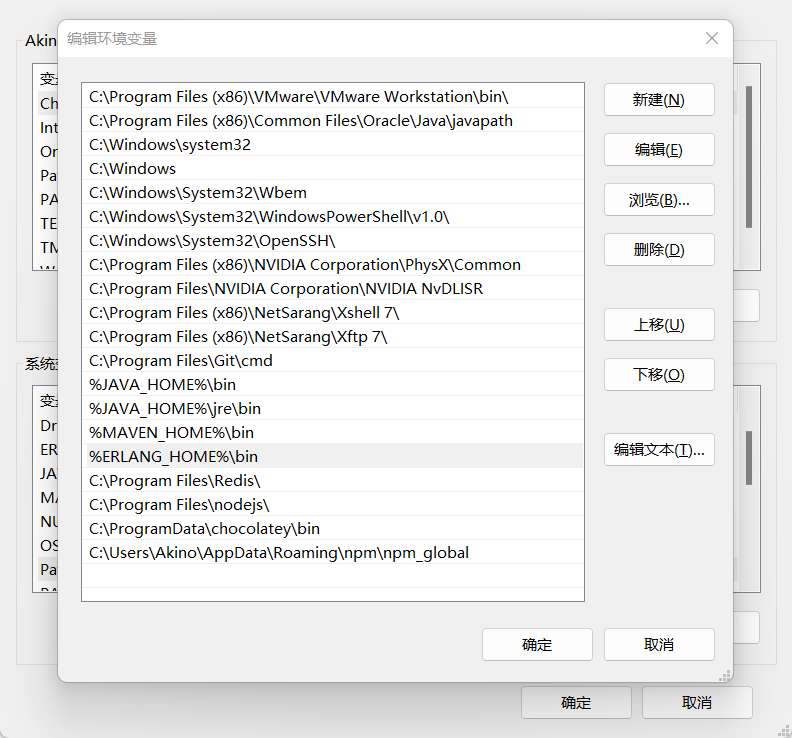

# 1. Window 安装

Erlang版本和RabbitMQ版本一定要对应，不然会出现各种报错问题

参考文档：https://www.rabbitmq.com/which-erlang.html

## 1.1 下载 Erlang

选择正确的对应 RabbitMQ 的版本(https://www.erlang.org/patches/otp-24.3.3)

一路 Next，不要怀疑，不过中间要是让你安装说明插件驱动不要立即重启

**配置环境变量**

1）将 Erlang 加入到环境变量中：

```cmd
变量名：ERLANG_HOME
变量值：C:\Program Files\erl-24.3.3
```


2）将其添加到 PATH 中：

```cmd
%ERLANG_HOME%\bin
```



## 1.2 下载 RabbitMQ

下载地址：(https://github.com/rabbitmq/rabbitmq-server/releases/tag/v3.9.14)，选择对应系统的版本

切换到安装目录的 sbin 目录，启动图形化界面：

```cmd
# 开启图形化界面
cd C:\Program Files\RabbitMQ Server\rabbitmq_server-3.9.14\sbin
rabbitmq-plugins enable rabbitmq_management
```

运行 RabbitMQ Service - start 或者 在任务管理器中打开服务RabbitMQ

```cmd
rabbitmq-server.bat
```

访问测试：

本地浏览器输入 http://localhost:15672

# 2. linux 安装

一般来说安装 RabbitMQ 之前要安装 Erlang ，可以去 Erlang 官网下载。接着去 RabbitMQ 官网下载安装包，之后解压缩即可。

Erlang 官方下载地址：https://www.erlang.org/downloads

RabbitMQ 官方下载地址：https://www.rabbitmq.com/download.html

## 2.1 安装前的准备

### 2.1.1 依赖包安装

安装 RabbitMQ 之前必须要先安装所需要的依赖包可以使用下面的一次性安装命令

yum install gcc glibc-devel make ncurses-devel openssl-devel xmlto -y

### 2.1.2 安装 Erlang

1、 将 Erlang 源代码包 otp_src_19.3.tar.gz 上传到 Linux 的/home 目录下

2、解压 erlang 源码包

tar -zxvf otp_src_19.3.tar.gz

3、手动创建 erlang 的安装目录

mkdir /usr/local/erlang

4、进入 erlang 的解压目录

cd otp_src_19.3

5、配置 erlang 的安装信息

./configure --prefix=/usr/local/erlang --without-javac

6、编译并安装

make && make install

7、配置环境变量

vim /etc/profile

8、将这些配置填写到 profile 文件的最后

ERL_HOME=/usr/local/erlang

PATH=$ERL_HOME/bin:$PATH

export ERL_HOME PATH

9、启动环境变量配置文件

source /etc/profile

## 2.2 安装 RabbitMQ

1、 将 RabbitMQ 安装包 rabbitmq-server-3.7.2-1.el7.noarch.rpm 上传到/home 目录

2、安装 RabbitMQ

rpm -ivh --nodeps rabbitmq-server-3.7.2-1.el7.noarch.rpm

## 2.3 RabbitMQ 常用命令

### 2.3.1 启动和关闭

1、启动 RabbitMQ

rabbitmq -server start

注意：这里可能会出现错误，错误原因是/var/lib/rabbitmq/.erlang.cookie 文件权限不够。

解决方案对这个文件授权

chown rabbitmq:rabbitmq /var/lib/rabbitmq/.erlang.cookie

chmod 400 /var/lib/rabbitmq/.erlang.cookie

2、停止服务

rabbitmqctl stop

### 2.3.2 插件管理

1、添加插件

rabbitmq-plugins enable {插件名}

2、删除插件

rabbitmq-plugins disable {插件名}

注意：RabbitMQ 启动以后可以使用浏览器进入管控台但是默认情况 RabbitMQ 不允许直接使用浏览器浏览器进行访问因此必须添加插件

rabbitmq-plugins enable rabbitmq_management

3、使用浏览器访问管控台 http://RabbitMQ 服务器 IP:15672

http://192.168.71.128:15672

### 2.3.3 用户管理

RabbitMQ 安装成功后使用默认用户名 guest 登录

账号：guest

密码：guest

注意：这里 guest 只允许本机登录访问需要创建用户并授权远程访问命令如下

1、 添加用户：rabbitmqctl add_user {username} {password}

rabbitmqctl add_user root root

2、 删除用户：rabbitmqctl delete_user {username}

3、 修改密码：rabbitmqctl change_password {username} {newpassword}

rabbitmqctl change_password root 123456

4、 设置用户角色：rabbitmqctl set_user_tags {username} {tag}

rabbitmqctl set_user_tags root administrator

tag 参数表示用户角色取值为：management *，*monitoring _，\*\*policymaker_ administrator

各角色详解：

management

用户可以通过 AMQP 做的任何事外加：

列出自己可以通过 AMQP 登入的 virtual hosts

查看自己的 virtual hosts 中的 queues, exchanges 和 bindings

查看和关闭自己的 channels 和 connections

查看有关自己的 virtual hosts 的“全局”的统计信息，包含其他用户在这些 virtual hosts 中的活动。

policymaker

management 可以做的任何事外加：

查看、创建和删除自己的 virtual hosts 所属的 policies 和 parameters

monitoring

management 可以做的任何事外加：

列出所有 virtual hosts，包括他们不能登录的 virtual hosts

查看其他用户的 connections 和 channels

查看节点级别的数据如 clustering 和 memory 使用情况

查看真正的关于所有 virtual hosts 的全局的统计信息

administrator

policymaker 和 monitoring 可以做的任何事外加:

创建和删除 virtual hosts

查看、创建和删除 users

查看创建和删除 permissions

关闭其他用户的 connections

### 2.3.4 权限管理

1、 授权命令：rabbitmqctl set_permissions [-p vhostpath] {user} {conf} {write} {read}

-p vhostpath ：用于指定一个资源的命名空间，例如 –p / 表示根路径命名空间

user：用于指定要为哪个用户授权填写用户名

conf:一个正则表达式 match 哪些配置资源能够被该用户配置。
write:一个正则表达式 match 哪些配置资源能够被该用户读。
read:一个正则表达式 match 哪些配置资源能够被该用户访问。

例如：

rabbitmqctl set*permissions -p / root '.*' '.\_' '.\*'

用于设置 root 用户拥有对所有资源的 读写配置权限

2、查看用户权限 rabbitmqctl list_permissions [vhostpath]

例如

查看根径经下的所有用户权限

rabbitmqctl list_permissions

查看指定命名空间下的所有用户权限

rabbitmqctl list_permissions /abc

3、查看指定用户下的权限 rabbitmqctl list_user_permissions {username}

例如

查看 root 用户下的权限

rabbitmqctl list_user_permissions root

4、清除用户权限 rabbitmqctl clear_permissions {username}

例如：

清除 root 用户的权限

rabbitmqctl clear_permissions root

### 2.3.5 vhost 管理

vhost 是 RabbitMQ 中的一个命名空间，可以限制消息的存放位置利用这个命名空间可以进行权限的控制有点类似 Windows 中的文件夹一样，在不同的文件夹中存放不同的文件。

1、添加 vhost: rabbitmqctl add vhost {name}

例如

rabbitmqctl add vhost bjpowernode

2、删除 vhost：rabbitmqctl delete vhost {name}

例如

rabbitmqctl delete vhost bjpowernode