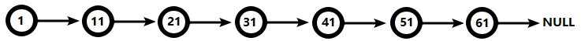
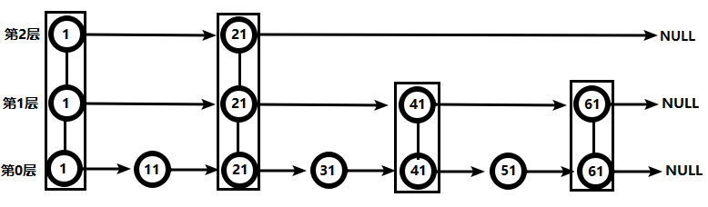

- Redis有序集合zset与普通集合set非常相似，是一个没有重复元素的字符串集合。

- 不同之处是有序集合的每个成员都关联了一个评分（score），这个评分（score）被用来按照从最低分到最高分的方式排序集合中的成员。集合的成员是唯一的，但是评分可以是重复了 。

- 因为元素是有序的, 所以你也可以很快的根据评分（score）或者次序（position）来获取一个范围的元素。

- 访问有序集合的中间元素也是非常快的,因此你能够使用有序集合作为一个没有重复成员的智能列表。

# 1. zadd 往有序集合添加成员

```bash
zadd key score1 value1 score2 value2 ...
# 往有序集合key添加成员

# 示例
127.0.0.1:6379> zadd ages 28 zhangsan 24 lisi 26 wangwu
(integer) 0
127.0.0.1:6379> zrange ages 0 -1
1) "lisi"
2) "wangwu"
3) "zhangsan"
```

# 2. zrange 按名次取成员

```bash
zrange key start stop [WITHSCORES]
# 把集合排序后，返回名次[start,stop]的成员按名次取成员
# 默认是升续排列，withscores 是把score也打印出来

# 示例
127.0.0.1:6379> zrange ages 0 -1 withscores
1) "lisi"
2) "24"
3) "wangwu"
4) "26"
5) "zhangsan"
6) "28"
```

# 3. zscore 获取指定成员的分数

```bash
ZSCORE key member
# 获取指定成员的分数

# 示例
127.0.0.1:6379> zadd height 175 zhangsan 167 lisi 185 wangwu
(integer) 3
127.0.0.1:6379> zscore height lisi
"167"
```

# 4. zrangebyscore 按分数取成员

```bash
zrangebyscore  key min max [withscores] limit offset N
# 集合(升序)排序后，取score在[min,max]内的成员，并跳过offset个，取出N个，按分数取成员

# 示例
127.0.0.1:6379> zadd ages 28 zhangsan 24 lisi 26 wangwu
(integer) 3
127.0.0.1:6379> zrangebyscore ages 25 30
1) "wangwu"
2) "zhangsan"
127.0.0.1:6379> zrangebyscore ages 25 30 limit 1 1
1) "zhangsan"
```

# 5. zrank/zrevrank 获取成员升序/降序的排名

```bash
zrank/zrevrank key member
# 查询member的升序/降序排名，名次从0开始

# 示例
127.0.0.1:6379> zadd ages 28 zhangsan 24 lisi 26 wangwu
(integer) 0
127.0.0.1:6379> zrange ages 0 -1
1) "lisi"
2) "wangwu"
3) "zhangsan"
127.0.0.1:6379> zrank ages zhangsan
(integer) 2
127.0.0.1:6379> zrevrank ages zhangsan
(integer) 0
```

# 6. zcount 计算分数区间成员个数

```bash
zcount key min max
# 计算[min,max]区间内成员的数量

# 示例
127.0.0.1:6379> zadd height 175 zhangsan 167 lisi 185 wangwu
(integer) 3
127.0.0.1:6379> zcount height 170 180
(integer) 1
```

# 7. zrem 删除有序集合成员

```bash
zrem key value1 value2 ..
# 删除集合中的成员

# 示例
127.0.0.1:6379> zrem ages wangwu
(integer) 1
127.0.0.1:6379> zrange ages 0 -1
1) "lisi"
2) "zhangsan"
```

# 8. zremrangebyrank 按排名删除成员

```bash
zremrangebyrank key start end
# 按排名删除成员，删除名次在[start,end]之间的

# 示例
127.0.0.1:6379> zadd height 175 zhangsan 167 lisi 185 wangwu 178 zhaoliu
(integer) 1
127.0.0.1:6379> zremrangebyrank height 0 1
(integer) 2
127.0.0.1:6379> zrange height 0 -1
1) "zhaoliu"
2) "wangwu"
```

# 9. zremrangebyscore 按分数删除成员

```bash
zremrangebyscore key min max
# 按照socre来删除成员，删除score在[min,max]之间的

# 示例
127.0.0.1:6379> zadd height 175 zhangsan 167 lisi 185 wangwu 178 zhaoliu
(integer) 2
127.0.0.1:6379> zremrangebyscore height 170 180
(integer) 2
127.0.0.1:6379> zrange height 0 -1
1) "lisi"
2) "wangwu"
```

# 10. zinterstore 求交集再计算

```bash
zinterstore destination numkeys key [key ...] [WEIGHTS weight [weight ...]] [AGGREGATE SUM|MIN|MAX]
# 求key1、key2...的交集，key1、key2...的权重分别是 weight1、weight2...
# 聚合方法用: sum|min|max
# 聚合的结果保存在destination集合内

# 示例
127.0.0.1:6379> zadd zhangsan 5 iphone6s 7 galaxyS7 6 huaweiP9
(integer) 3
127.0.0.1:6379> zadd lisi 3 iphone6s 9 galaxyS7 4 huaweiP9 2 HTC10
(integer) 4
127.0.0.1:6379> zinterstore result 2 zhangsan lisi
(integer) 3
127.0.0.1:6379> zrange result 0 -1 withscores
1) "iphone6s"
2) "8"
3) "huaweiP9"
4) "10"
5) "galaxyS7"
6) "16"
127.0.0.1:6379> zinterstore result 2 zhangsan lisi aggregate max
(integer) 3
127.0.0.1:6379> zrange result 0 -1 withscores
1) "iphone6s"
2) "5"
3) "huaweiP9"
4) "6"
5) "galaxyS7"
6) "9"
```

# 11. zunionstore 求并集再计算

```bash
zunionstore destination numkeys key [key ...] [WEIGHTS weight [weight ...]] [AGGREGATE SUM|MIN|MAX]
# 求key1、key2...的并集，key1、key2...的权重分别是 weight1、weight2...
# 聚合方法用: sum|min|max
# 聚合的结果保存在destination集合内

# 示例
127.0.0.1:6379> zadd zhangsan 4 iphone6s 6 huaweiP9 8 xiaomi5
(integer) 3
127.0.0.1:6379> zadd lisi 2 iphone6s 8 galaxS7 5 meizu6
(integer) 3
127.0.0.1:6379> zunionstore result 2 zhangsan lisi
(integer) 5
127.0.0.1:6379> zrange result 0 -1 withscores
 1) "meizu6"
 2) "5"
 3) "huaweiP9"
 4) "6"
 5) "iphone6s"
 6) "6"
 7) "galaxS7"
 8) "8"
 9) "xiaomi5"
10) "8"
127.0.0.1:6379> zunionstore result 2 zhangsan lisi aggregate max
(integer) 5
127.0.0.1:6379> zrange result 0 -1 withscores
 1) "iphone6s"
 2) "4"
 3) "meizu6"
 4) "5"
 5) "huaweiP9"
 6) "6"
 7) "galaxS7"
 8) "8"
 9) "xiaomi5"
10) "8"
```


# 12. 跳跃表（跳表）

## 1. 简介

有序集合在生活中比较常见，例如根据成绩对学生排名，根据得分对玩家排名等。对于有序集合的底层实现，可以用数组、平衡树、链表等。数组不便元素的插入、删除；平衡树或红黑树虽然效率高但结构复杂；链表查询需要遍历所有效率低。Redis采用的是跳跃表。跳跃表效率堪比红黑树，实现远比红黑树简单。

## 2. 实例

  对比有序链表和跳跃表，从链表中查询出51

（1）  有序链表



要查找值为51的元素，需要从第一个元素开始依次查找、比较才能找到。共需要6次比较。

（2）  跳跃表

 

从第2层开始，1节点比51节点小，向后比较。

21节点比51节点小，继续向后比较，后面就是NULL了，所以从21节点向下到第1层

在第1层，41节点比51节点小，继续向后，61节点比51节点大，所以从41向下

在第0层，51节点为要查找的节点，节点被找到，共查找4次。

**从此可以看出跳跃表比有序链表效率要高**