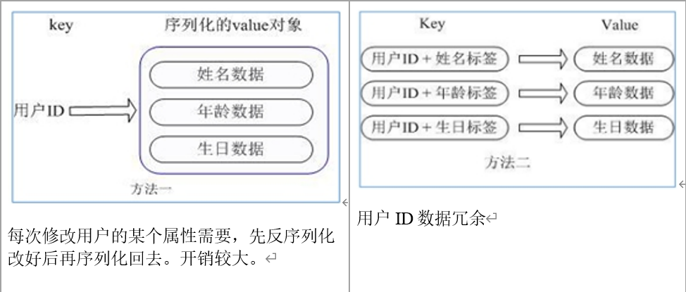
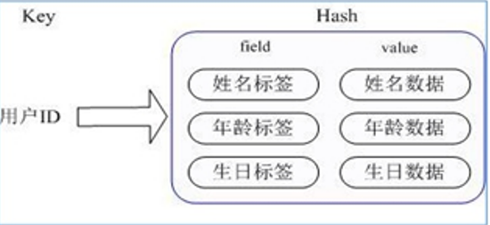

- Redis hash 是一个键值对集合。

- Redis hash是一个string类型的field和value的映射表，hash特别适合用于存储对象。

- 类似Java里面的Map<String,Object>，用户ID为查找的key，存储的value用户对象包含姓名，年龄，生日等信息，如果用普通的key/value结构来存储

主要有以下2种存储方式：




通过 key(用户ID) + field(属性标签) 就可以操作对应属性数据了，既不需要重复存储数据，也不会带来序列化和并发修改控制的问题



# 1. hset 设置哈希field域的值

```bash
hset key field value
# 把key中 filed域的值设为value
# 注:如果没有field域，直接添加，如果有，则覆盖原field域的值

# 示例
127.0.0.1:6379> hset user name zhangsan
(integer) 1
127.0.0.1:6379> hset user age 25
(integer) 1
127.0.0.1:6379> hset user gender male
(integer) 1
```

# 2. hmset 设置哈希多个field域的值

```bash
hmset key field1 value1 [field2 value2 field3 value3 ......fieldn valuen]
# 一次设置多个field和对应的value

# 示例
127.0.0.1:6379> hmset user name lisi age 26 gender male
OK
```

# 3. hget 获取指定field域的值

```bash
hget key field
# 获取field域的值

# 示例
127.0.0.1:6379> hmset user name lisi age 26 gender male
OK
127.0.0.1:6379> hget user age
"26
```

# 4. hmget 获取多个指定field域的值

```bash
hget key field
# 获取多个field域的值

# 示例
127.0.0.1:6379> hmset user name lisi age 26 gender male
OK
127.0.0.1:6379> hmget user name age
1) "lisi"
2) "26"
```

# 5. hkeys 获取所有field域的名字

```bash
hkeys key
# 获取key中所有的field

# 示例
127.0.0.1:6379> hmset user name zhangsan age 25 gender male
OK
127.0.0.1:6379> hkeys user
1) "name"
2) "age"
3) "gender"
```

# 6. hvals 获取所有field域的值

```bash
kvals key
# 返回key中所有的value

# 示例
127.0.0.1:6379> hmset user name zhangsan age 25 gender male
OK
127.0.0.1:6379> hvals user
1) "zhangsan"
2) "25"
3) "male"
```


# 7. hgetall 获取所有field域和值

```bash
hgetall key
# 获取哈希key的所有field域和值

# 示例
127.0.0.1:6379> hmset user name lisi age 26 gender male
127.0.0.1:6379> hgetall user
1) "name"
2) "lisi"
3) "age"
4) "26"
5) "gender"
6) "male"
```

# 8. hlen 获取field的数量

```bash
hlen key
# 获取field的数量

# 示例
127.0.0.1:6379> hmset user name lisi age 26 gender male
127.0.0.1:6379> hlen user
(integer) 3
```

# 9. hdel 删除field域

```bash
hdel key field
# 删除key中 field域

# 示例
127.0.0.1:6379> hmset user name lisi age 26 gender male
127.0.0.1:6379> hdel user age
(integer) 1
127.0.0.1:6379> hgetall user
1) "name"
2) "lisi"
3) "gender"
4) "male"
```

# 10. hexists 判断field域是否存在

```bash
hexists key field
# 判断key中有没有field域

# 示例
127.0.0.1:6379> hmset user name lisi age 26 gender male
OK
127.0.0.1:6379> hexists user age
(integer) 1
127.0.0.1:6379> hexists user height
(integer) 0
```

# 11. hincrby 使field域的值加上整数

```bash
hincrby key field value
# 使key中的field域的值加上整型值value

# 示例
127.0.0.1:6379> hmset user name zhangsan height 158
OK
127.0.0.1:6379> hincrby user height 2
(integer) 160
```

# 12. hincrbyfloat 使field域的值加上浮点数

```bash
hincrbyfloat key field value
# 使key中的field域的值加上浮点值value

# 示例
127.0.0.1:6379> hmset user name zhangsan height 158
OK
127.0.0.1:6379> hincrbyfloat user height 5.5
"165.5"
```

