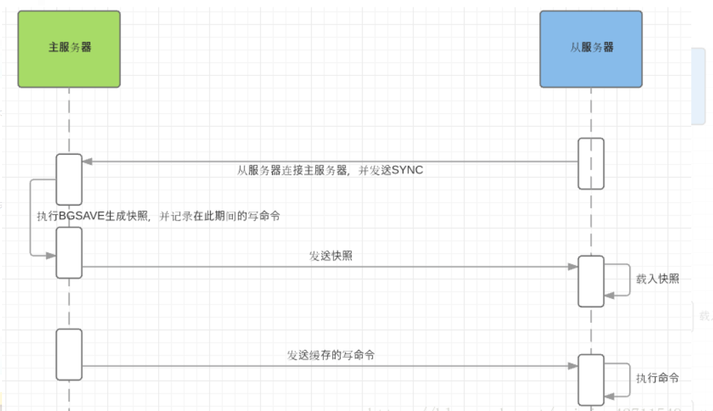

> 官网：http://www.redis.cn/topics/replication.html

# 1. 主从复制搭建

指将一台Redis服务器的数据，复制到其他的Redis服务器。前者称为主节点（Master/Leader），后者称为从节点（Slave/Follower）， 数据的复制是单向的！只能由主节点复制到从节点（**主节点以写为主、从节点以读为主**）。Redis的主从复制是**异步复制**，异步分为两个方面，一个是master服务器在将数据同步到slave时是异步的，因此master服务器在这里仍然可以接收其他请求，一个是slave在接收同步数据也是异步的。

Redis使用默认的异步复制，其特点是低延迟和高性能，是绝大多数 Redis 用例的自然复制模式。但是，从 Redis 服务器会异步地确认其从主 Redis 服务器周期接收到的数据量。

## 1.1新建redisxxxx.conf从服务器的配置文件:

```bash
include /myredis/redis.conf
pidfile /var/run/redis_6379.pid
port 6379
dbfilename dump6379.rdb

include /myredis/redis.conf
pidfile /var/run/redis_6380.pid
port 6380
dbfilename dump6380.rdb

include /myredis/redis.conf
pidfile /var/run/redis_6381.pid
port 6381
dbfilename dump6381.rdb
```

## 1.2 启动三台redis服务器

```bash
# 启动一主二从redis服务器
[root@localhost myredis]# redis-server redis6379.conf
[root@localhost myredis]# redis-server redis6380.conf
[root@localhost myredis]# redis-server redis6381.conf
[root@localhost myredis]# ps -ef|grep redis
root       1996      1  0 18:58 ?        00:00:00 redis-server *:6379
root       2002      1  0 18:58 ?        00:00:00 redis-server *:6380
root       2008      1  0 18:58 ?        00:00:00 redis-server *:6381
root       2022   1627  0 18:58 pts/0    00:00:00 grep --color=auto redis

```

## 1.3 设置 master 和 slave

### 1.3.1 配置主从复制

方式一：客户端发送同步命令

```bash
saveof 127.0.0.1 6379
```

方式二：slave服务器配置master服务器，分别进入redis从服务器（端口6380、6381）的客户端并执行以下命令：

```bash
[root@localhost ~]# cd /usr/local/bin/myredis
[root@localhost myredis]# redis-cli -p 6380
127.0.0.1:6380> slaveof 127.0.0.1 6379  # 设置自己为slave服务器，并连接master服务器
OK

[root@localhost ~]# cd /usr/local/bin/myredis
[root@localhost myredis]# redis-cli -p 6381
127.0.0.1:6381> slaveof 127.0.0.1 6379  # 设置自己为slave服务器，并连接master服务器
OK
```

通过上面两种方式的配置，master服务器与slave服务器便已经可以开始进行数据同步了。

### 1.3.2 master和slave服务器信息

master服务器：

```bash
127.0.0.1:6379> info replication
# Replication
role:master        # 表示为master主服务器
connected_slaves:2 # 当前连接slave服务器数量
slave0:ip=127.0.0.1,port=6380,state=online,offset=14,lag=1  # slave服务器1
slave1:ip=127.0.0.1,port=6381,state=online,offset=14,lag=0  # slave服务器2
master_failover_state:no-failover
master_replid:54d82c7e55955f912009f3a82c2b26ca100ffd74
master_replid2:0000000000000000000000000000000000000000
master_repl_offset:7980
second_repl_offset:-1
repl_backlog_active:1
repl_backlog_size:1048576
repl_backlog_first_byte_offset:1
repl_backlog_histlen:7980
```

slave服务器：

```bash
127.0.0.1:6380> info replication  # 打印slave从服务器信息
# Replication
role:slave             # 表示为slave从服务器
master_host:127.0.0.1  # 主服务器的ip
master_port:6379       # 主服务器的端口号
master_link_status:up
master_last_io_seconds_ago:2
master_sync_in_progress:0
slave_read_repl_offset:5278
slave_repl_offset:5278
slave_priority:100
slave_read_only:1
replica_announced:1
connected_slaves:0
master_failover_state:no-failover
master_replid:54d82c7e55955f912009f3a82c2b26ca100ffd74
master_replid2:0000000000000000000000000000000000000000
master_repl_offset:5278
second_repl_offset:-1
repl_backlog_active:1
repl_backlog_size:1048576
repl_backlog_first_byte_offset:1
repl_backlog_histlen:5278
```


# 2. 作用

## 2.1 保存Redis数据副本

当我们只是通过RDB或AOF把Redis的内存数据持久化毕竟只是在本地，并不能保证绝对的安全，而通过将数据同步slave服务器上，可以保留多一个数据备份，更好地保证数据的安全。

## 2.2 读写分离

在配置了主从复制之后，如果master服务器的读写压力太大，可以进行读写分离，客户端向master服务器写入数据，在读数据时，则访问slave服务器，从而减轻master服务器的访问压力。

## 2.3 高可用性与故障转移（容灾恢复）

服务器的高可用性是指服务器能提供7*24小时不间断的服务，Redis可以通过Sentinel系统管理多个Redis服务器，当master服务器发生故障时，Sentineal系统会根据一定的规则将某台slave服务器升级为master服务器，继续提供服务，实现故障转移，从而保证Redis服务不间断。


# 3. 工作原理

master服务器会记录一个`replication ID`的伪随机字符串，用于标识当前的数据集版本，还会记录一个当数据集的偏移量`offset`，不管master是否有配置slave服务器，replication ID和offset会一直记录并成对存在，我们可以通过命令info replication查看replication ID和offset，不同服务器数据不同，打印信息不同。

```bash
127.0.0.1:6379> info replication
# Replication
role:master        # 表示为master主服务器
connected_slaves:2 # 当前连接slave服务器数量
slave0:ip=127.0.0.1,port=6380,state=online,offset=14,lag=1  # slave服务器1
slave1:ip=127.0.0.1,port=6381,state=online,offset=14,lag=0  # slave服务器2
master_failover_state:no-failover
master_replid:54d82c7e55955f912009f3a82c2b26ca100ffd74
master_replid2:0000000000000000000000000000000000000000
master_repl_offset:14
second_repl_offset:-1
repl_backlog_active:1
repl_backlog_size:1048576
repl_backlog_first_byte_offset:1
repl_backlog_histlen:14
```

当master与slave正常连接时，slave使用PSYNC命令向master发送自己记录的旧master的replication ID和offset，而master会计算与slave之间的数据偏移量，并将缓冲区中的偏移数量同步到slave，此时master和slave的数据一致。

而如果slave引用的replication太旧了，master与slave之间的数据差异太大，则master与slave之间会使用全量复制的进行数据同步。

## 3.1 全量复制（全量同步）

Redis全量复制一般发生在Slave初始化阶段，这时Slave需要将Master上的所有数据都复制一份。具体步骤如下： 

1. 从服务器连接主服务器，发送SYNC命令； 

2. 主服务器接收到SYNC命名后，开始执行BGSAVE命令生成RDB文件并使用缓冲区记录此后执行的所有写命令； 

3. 主服务器BGSAVE执行完后，向所有从服务器发送快照文件，并在发送期间继续记录被执行的写命令； 

4. 从服务器收到快照文件后丢弃所有旧数据，载入收到的快照； 

5. 主服务器快照发送完毕后开始向从服务器发送缓冲区中的写命令； 

6. 从服务器完成对快照的载入，开始接收命令请求，并执行来自主服务器缓冲区的写命令； 



完成上面几个步骤后就完成了从服务器数据初始化的所有操作，从服务器此时可以接收来自用户的读请求。

## 3.2 增量复制（增量同步）

Redis增量复制是指Slave初始化后开始正常工作时主服务器发生的写操作同步到从服务器的过程。 

增量复制的过程主要是主服务器每执行一个写命令就会向从服务器发送相同的写命令，从服务器接收并执行收到的写命令。

## 3.3 Redis主从同步策略

主从刚刚连接的时候，进行全量同步；全同步结束后，进行增量同步。当然，如果有需要，slave 在任何时候都可以发起全量同步。Redis 策略是，无论如何，首先会尝试进行增量同步，如不成功，要求从机进行全量同步。

**注意点：如果多个Slave断线了，需要重启的时候，因为只要Slave启动，就会发送sync请求和主机全量同步，当多个同时出现的时候，可能会导致Master IO剧增宕机。**

## 3.4 增量同步

当完成数据同步之后，主从服务器的数据暂时达到一致状态，当主服务器执行了客户端的写命令之后，主从的数据便不再一致。为了能够使主从服务器的数据保持一致性，主服务器会对从服务器执行命令传播操作，即每执行一个写命令就会向从服务器发送同样的写命令

在命令传播阶段，从服务器会默认以每秒一次的频率向主服务器发送**心跳检测**

```bash
REPLCONF ACK <replication_offset>
```

其中replication_offset是当前从服务器的复制偏移量，该命令的作用有三个

- 检测主从服务器的网络连接状态
- 辅助实现min-slaves选项
- 检测命令丢失


# 4. Redis主从复制特点

- Redis 使用异步复制，slave 和 master 之间异步地确认处理的数据量
- 一个 master 可以拥有多个 slave
- slave 可以接受其他 slave 的连接。除了多个 slave 可以连接到同一个 master 之外， slave 之间也可以像层叠状的结构（cascading-like structure）连接到其他 slave 。自 Redis 4.0 起，所有的 sub-slave 将会从 master 收到完全一样的复制流。
- Redis 复制在 master 侧是非阻塞的。这意味着 master 在一个或多个 slave 进行初次同步或者是部分重同步时，可以继续处理查询请求。
- 复制在 slave 侧大部分也是非阻塞的。当 slave 进行初次同步时，它可以使用旧数据集处理查询请求，假设你在 redis.conf 中配置了让 Redis 这样做的话。否则，你可以配置如果复制流断开， Redis slave 会返回一个 error 给客户端。但是，在初次同步之后，旧数据集必须被删除，同时加载新的数据集。 slave 在这个短暂的时间窗口内（如果数据集很大，会持续较长时间），会阻塞到来的连接请求。自 Redis 4.0 开始，可以配置 Redis 使删除旧数据集的操作在另一个不同的线程中进行，但是，加载新数据集的操作依然需要在主线程中进行并且会阻塞 slave 。
- 复制既可以被用在可伸缩性，以便只读查询可以有多个 slave 进行（例如 O(N) 复杂度的慢操作可以被下放到 slave ），或者仅用于数据安全。
- 可以使用复制来避免 master 将全部数据集写入磁盘造成的开销：一种典型的技术是配置你的 master Redis.conf 以避免对磁盘进行持久化，然后连接一个 slave ，其配置为不定期保存或是启用 AOF。但是，这个设置必须小心处理，因为重新启动的 master 程序将从一个空数据集开始：如果一个 slave 试图与它同步，那么这个 slave 也会被清空。


# 5. 关闭持久化时，复制的安全性

在使用 Redis 复制功能时的设置中，强烈建议在 master 和在 slave 中启用持久化。当不可能启用时，例如由于非常慢的磁盘性能而导致的延迟问题，**应该配置实例来避免重置后自动重启**。

为了更好地理解为什么关闭了持久化并配置了自动重启的 master 是危险的，检查以下故障模式，这些故障模式中数据会从 master 和所有 slave 中被删除：

1. 我们设置节点 A 为 master 并关闭它的持久化设置，节点 B 和 C 从 节点 A 复制数据。
2. 节点 A 崩溃，但是他有一些自动重启的系统可以重启进程。但是由于持久化被关闭了，节点重启后其数据集合为空。
3. 节点 B 和 节点 C 会从节点 A 复制数据，但是节点 A 的数据集是空的，因此复制的结果是它们会销毁自身之前的数据副本。

当 Redis Sentinel 被用于高可用并且 master 关闭持久化，这时如果允许自动重启进程也是很危险的。例如， master 可以重启的足够快以致于 Sentinel 没有探测到故障，因此上述的故障模式也会发生。

任何时候数据安全性都是很重要的，所以如果 master 使用复制功能的同时未配置持久化，那么自动重启进程这项应该被禁用。


# 6. 主从复制中的key过期问题

Redis 的过期机制可以限制 key 的生存时间。此功能取决于 Redis 实例计算时间的能力，但是，即使使用 Lua 脚本更改了这些 key，Redis slaves 也能正确地复制具有过期时间的 key。

为了实现这样的功能，Redis 不能依靠主从使用同步时钟，因为这是一个无法解决的并且会导致 race condition 和数据集不一致的问题，所以 Redis 使用三种主要的技术使过期的 key 的复制能够正确工作：

- slave 不会让 key 过期，而是等待 master 让 key 过期。当一个 master 让一个 key 到期（或由于 LRU 算法将之驱逐）时，它会合成一个 DEL 命令并传输到所有的 slave。
- 但是，由于这是 master 驱动的 key 过期行为，master 无法及时提供 DEL 命令，所以有时候 slave 的内存中仍然可能存在在逻辑上已经过期的 key 。为了处理这个问题，slave 使用它的逻辑时钟以报告只有在不违反数据集的一致性的读取操作（从主机的新命令到达）中才存在 key。用这种方法，slave 避免报告逻辑过期的 key 仍然存在。在实际应用中，使用 slave 程序进行缩放的 HTML 碎片缓存，将避免返回已经比期望的时间更早的数据项。
- 在Lua脚本执行期间，不执行任何 key 过期操作。当一个Lua脚本运行时，从概念上讲，master 中的时间是被冻结的，这样脚本运行的时候，一个给定的键要么存在要么不存在。这可以防止 key 在脚本中间过期，保证将相同的脚本发送到 slave ，从而在二者的数据集中产生相同的效果。

一旦一个 slave 被提升为一个 master ，它将开始独立地过期 key，而不需要任何旧 master 的帮助。
