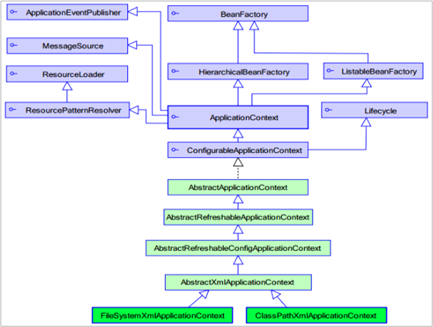

# Spring的核心容器

# 1. BeanFactory

BeanFactory就是一个管理Bean的工厂，它主要负责初始化各种Bean，并调用它们的声明周期方法。

BeanFactory接口提供了几个实现类，其中最常用的是org.springframework.beans.factory.xml.XmlBeanFactory，该类会根据XML配置文件中的定义来装配Bean。

```java
BeanFactory beanFactory = new XmlBeanFactory(new FileSystemResource("F:/applicationContext.xml"));
```

***注：这种加载方式在实际开发中并不多用，了解即可。***


# 2. ApplicationContext

ApplicationContext：接口类型，代表应用上下文，可以通过其实例获得 Spring 容器中的 Bean 对象



ApplicationContext是BeanFactory的子接口，也被称为应用上下文，是另一种常用的Spring核心容器。

它由org.springframework.context.ApplicationContext接口欧定义，不仅包含了BeanFactory的所有功能，还添加了对国际化、资源访问、事件传播等方面的支持。

```java
//Resources资源下的相对路径
ApplicationContext app = new ClassPathXmlApplicationContext("applicationContext.xml");

//它是从磁盘路径上加载配置文件，配置文件可以在磁盘的任意位置。这种会导致程序的灵活性变差，所以一般不推荐使用
ApplicationContext app = new FileSystemXmlApplicationContext("F:/applicationContext.xml");

//当使用注解配置容器对象时，需要使用此类来创建 spring 容器。它用来读取注解。
ApplicationContext app = new AnnotationConfigApplicationContext("applicationContext.xml");
```

**注：实例化ClassPathXmlApplicationContext这种方法在开发中最常用**