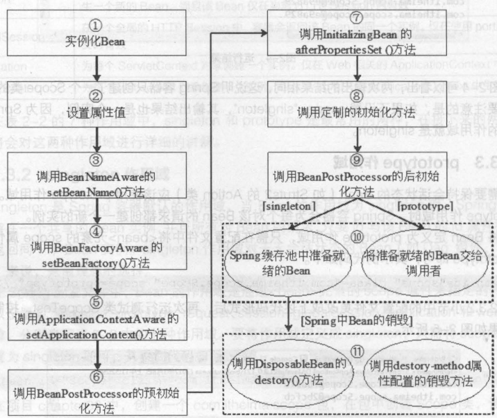

# Bean的生命周期

( 1 ) 根据配置情况调用 Bean 构造方法或工厂方法实例化 Bean。

( 2 ) 利用依赖注入完成 Bean 中所有属性值的配置注入。

( 3 ) 如果 Bean 实现了 BeanNameAware 接口，则 Spring 调用 Bean 的 setBeanName() 方法传入当前 Bean 的 id 值 。

( 4 ) 如果 Bean 实现了 BeanFactoryAware 接口，则 Spring 调用 setBeanFactory() 方法传入当前工厂实例的引用。

( 5 ) 如果 Bean 实现了 ApplicationContextAware 接口，则 Spring 调用 setApplicationContext() 方法传入当前 ApplicationContext 实例的引用。

( 6 ) 如果 BeanPostProcessor 和 Bean 关联，则 Spring 将调用该接口的预初始化方法postProcessBeforelnitialzation()对 Bean 进行加工操作，这个非常重要， Spring AOP 就是用它实现的。

( 7 ) 如果 Bean 实现了 InitializingBean 接口，则 Spring 将调用 afterPropertiesSet() 方法。

( 8 ) 如果在配置文件中通过 init-method 属性指定了初始化方法，则调用该初始化方法。

( 9 ) 如果有 BeanPostProcessor 和 Bean 关联，则 Spring 将调用该接口的初始化方法 postProcessAfterlnitialization() 。此时， Bean 已经可以被应用系统使用了。

( 10 ) 如果在 <bean> 中指定了该 Bean 的作用范围为 scope="singleton" ，则将该 BeanSpring loC 的缓存池中，将触发 Spring 对该 Bean 的生命周期管理；如果在<bean> 中指定了Bean 的作用范围为 scope="prototype" ，则将该 Bean 交给调用者，调用者管理该 Bean 的生命周期， Spring 不再管理该 Bean。

( 11 ) 如果 Bean 实现了 DisposableBean 接口，则 Spring 会调用 destory() 方法将 Spring 中的 Bean 销毁；如果在配置文件中通过 destory-method 属性指定了 Bean 的销毁方法，则 Spring 将调用该方法进行销毁。

**Spring 为 Bean 提供了细致全面的生命周期过程，通过实现特定的接口或通过<bean> 的属性设置，都可以对 Bean 的生命周期过程产生影响。我们可以随意地配置 <bean> 的属性，但是在这里建议不要过多地使用 Bean 实现接口，因为这样会使代码和 Spring 聚合比较紧密。**

---

# 1. 当scope的取值为singleton时

在此作用域下， Spring 能够精确地知道该 Bean 何时被创建，何时初始化完成以及何时被销毁。

Bean的实例化个数：1个

Bean的实例化时机：当Spring核心文件被加载时，实例化配置的Bean实例

Bean的生命周期：

- 对象创建：当应用加载，创建容器时，对象就被创建了
- 对象运行：只要容器在，对象一直活着
- 对象销毁：当应用卸载，销毁容器时，对象就被销毁了

# 2. 当scope的取值为prototype时

对于 prototype 作用域的 Bean , Spring 只负责创建，当容器创建了 Bean 实例后， Bean 的实例就交给客户端代码来管理，Spring 容器将不再跟踪其生命周期。

每次客户端请求 prototype 作用域的 Bean 时， Spring 容器都会创建一个新的实例，并且不会管那些被配置成 prototype 作用域的 Bean 的生命周期。

Bean的实例化个数：多个

Bean的实例化时机：当调用getBean()方法时实例化Bean

- 对象创建：当使用对象时，创建新的对象实例
- 对象运行：只要对象在使用中，就一直活着
- 对象销毁：当对象长时间不用时，被 Java 的垃圾回收器回收了
- init-method：指定类中的初始化方法名称
- destroy-method：指定类中销毁方法名称