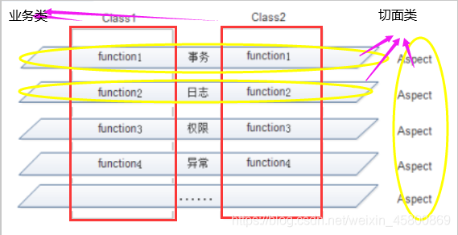
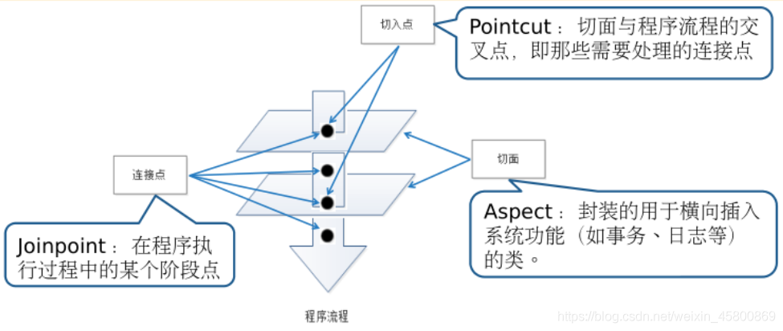
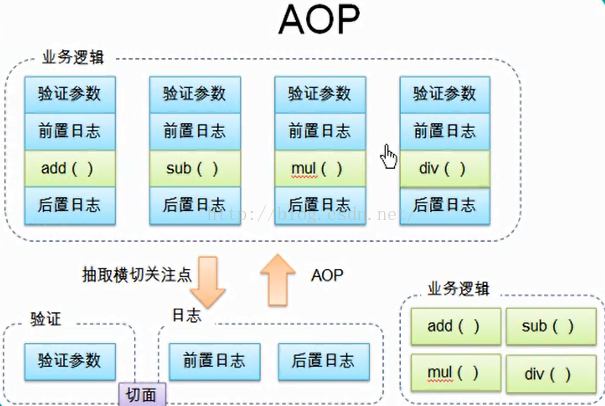

# AOP概念原理

## 1. 什么是 AOP

- AOP（Aspect Oriented Programming）称为面向切面编程，通过预编译方式和运行期间动态代理实现程序功能的统一维护的一种技术。
- AOP是OOP的延续，是软件开发中的一个热点，也是Spring框架中的一个重要内容，是函数式编程的一种衍生范型。
- 利用AOP可以对业务逻辑的各个部分进行隔离，从而使得业务逻辑各部分之间的耦合度降低，提高程序的可重用性，同时提高了开发的效率。

## 2. AOP 的作用及其优势

- 作用：在程序运行期间，在不修改源码的情况下对方法进行功能增强
- 优势：减少重复代码，提高开发效率，并且便于维护

## 3. AOP 的底层实现

实际上，AOP 的底层是通过 Spring 提供的的动态代理技术实现的。在运行期间，Spring通过动态代理技术动态的生成代理对象，代理对象方法执行时进行增强功能的介入，在去调用目标对象的方法，从而完成功能的增强。

## 4. AOP 的动态代理技术	

- JDK 代理 : 基于接口的动态代理技术（针对实现接口的类产生代理)
- cglib 代理：基于父类的动态代理技术（针对没有实现接口的类产生代理）

## 5. AOP 术语

- Aspect (切面)：在实际应用中，切面通常是指封装的用于横向插入系统功能(如事务、日志等)的类，如图中的 Aspect 该类要被 Spring 容器识别为切面，需要在配置文件中通过<bean>元素指定。
- Joinpoint (连接点)：在程序执行过程中的某个阶段点，它实际上是对象的一个操作，例如方法的调用或异常的抛出 Spring AOP 中，连接点就是指方法的调用。
- Pointcut (切入点)：是指切面与程序流程的交叉点，即那些需要处理的连接点，如图所示。通常在程序中，切入点指的是类或者方法名，如某个通知要应用到所有以 add 开头的方法中，那么所有满足这一规则的方法都是切入点。
- Advice (通知/增强处理)：AOP 框架在特定的切入点执行的增强处理，即在定义好的切入点处所要执行的程序代码。可以将其理解为切面类中的方法，它是切面的具体实现。
- Target Object (目标对象):是指所有被通知的对象，也称为被增强对象。如果 AOP 框架采用的是动态的 AOP 实现，那么该对象就是一个被代理对象。
- Proxy (代理):将通知应用到目标对象之后，被动态创建的对象。
- Weaving (织入):将切面代码插入到目标对象上，从而生成代理对象的过程。

