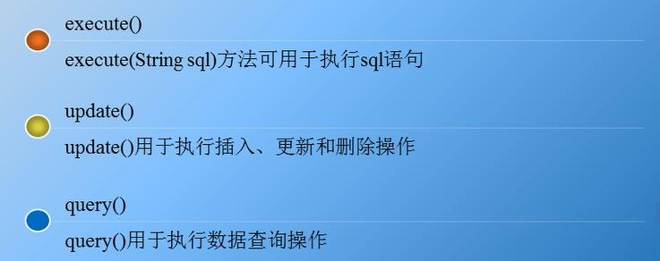

# Spring JDBC

## 1. Spring JdbcTemplate 的解析

针对数据库的操作， Spring 框架提供了 JdbcTemplate 类，该类是 Spring 框架数据抽象层的基础，其他更高层次的抽象类却是构建于 JdbcTemplate 类之上可以说， JdbcTemplate 类是 Spring JDBC 的核心类。

Jdbc Template 类的继承关系十分简单，它继承自抽象类 JdbcAccessor ，同时实现了 JdbcOperations 接口，如图所示


从图可以看出， JdbcTemplate 类的直接父类是 JdbcAccessor ，该类为子类提供了一些访问数据库时使用的公共属性，具体如下：

- DataSource: 其主要功能是获取数据库连接，具体实现时还可以引入对数据库连接的缓冲池和分布式事务的支持，它可以作为访问数据库资源的标准接口。
- SOLExceptionTranslator: org.springframework.jdbc.support.SOLExceptionTranslator 接口负责对 SOLException 进行转译工作。通过必要的设置或者获取 SOLExceptionTranslator 中的方法，可以使 JdbcTemplate 在需要处理 SOLException 时，委托 SOLExceptionTranslator 的实现类来完成相关的转译工作。

JdbcOperations 接口定义了在 JdbcTemplate 类中可以使用的操作集合，包括添加、修改、查询和删除等操作。

## 2. Spring JDBC 的配置

Spring JDBC 模块主要由4个包组成，分别是 core (核心包)、 dataSource (数据源包)、object (对象包)和 support (支持包)，关于这4个包的具体说明如表所示


| 包名       | 说明                                                         |
| ---------- | ------------------------------------------------------------ |
| core       | 包含了 JDBC 的核心功能，包括 JdbcTemplate 类、 SimpleJdbclnsert 类、 SimpleJdbcCall 类以及 NamedParameterJdbcTemplate 类 |
| dataSource | 访问数据源的实用工具类，白有多种数据源的实现，可以在 Java EE 容器外部测试 JDBC 代码 |
| object     | 以面向对象的方式访问数据库， 允许执行查询并将返回结果作为业务对象，可以在数据袤的列和业务对象的属性之间映射查询结果 |
| support    | 包含了 core 和 object 包的支持类，例如，提供异常转换功能的 SQLException 类 |

```xml
<!-- applicationContext.xml -->
    <!-- 1配置数据源 -->
	<bean id="dataSource" class="org.springframework.jdbc.datasource.DriverManagerDataSource">
		<!--数据库驱动 -->
		<property name="driverClassName" value="com.mysql.jdbc.Driver" />
		<!--连接数据库的url -->
		<property name="url" value="jdbc:mysql://localhost:3306/spring" />
		<!--连接数据库的用户名 -->
		<property name="username" value="root" />
		<!--连接数据库的密码 -->
		<property name="password" value="root" />
	</bean>
	<!-- 2配置JDBC模板 -->
	<bean id="jdbcTemplate" class="org.springframework.jdbc.core.JdbcTemplate">
		<!-- 默认必须使用数据源 -->
		<property name="dataSource" ref="dataSource" />
	</bean>
```

## 3. Spring JdbcTemplate的常用方法



> **execute和update的区别**

1、update可以带参数，而execute不可以。例如：

- JdbcTemplate.update("update TableA set name = 'Andy' where id=?", new Object[] {new Integer(3)} );
- JdbcTemplate.execute("update TableA set name = 'Andy' where id=3" );

2、update背后是借助于Java.sql.PreparedStatement完成，而execute是基于java.sql.Statement。

3、update返回int, 即受影响的行数。execute返回void

4、execute不接受参数，无返回值，适用于create和drop table。