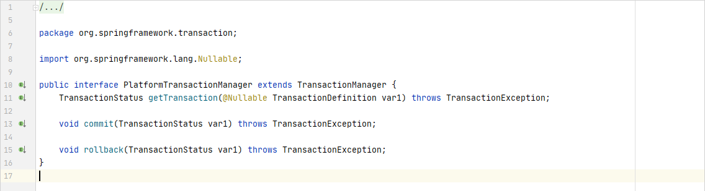
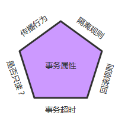
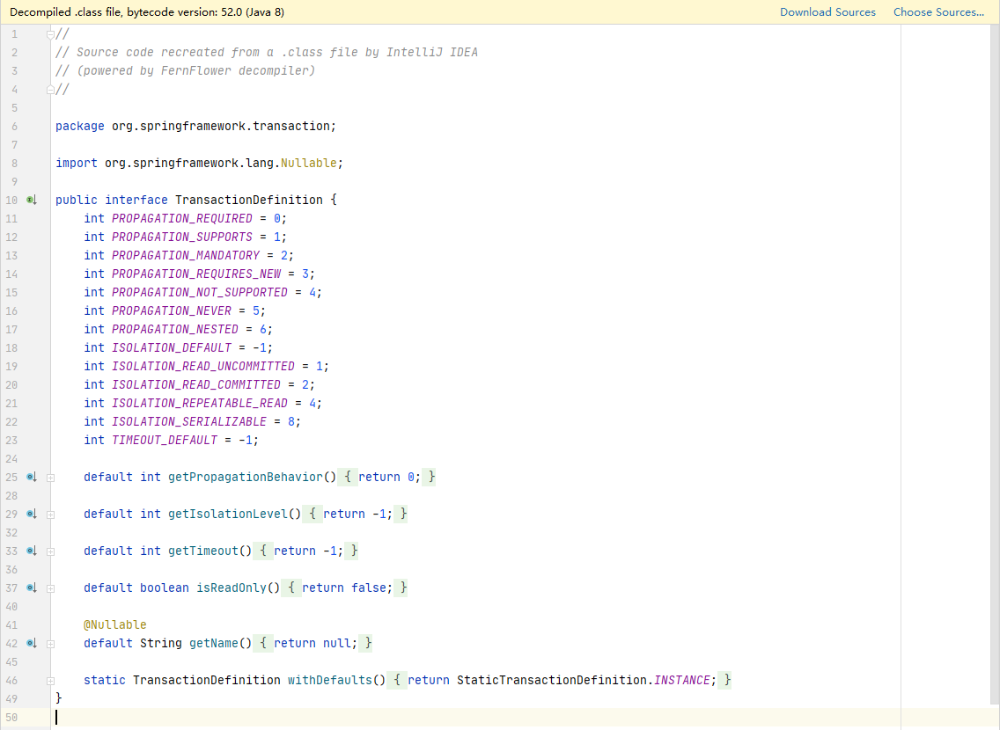
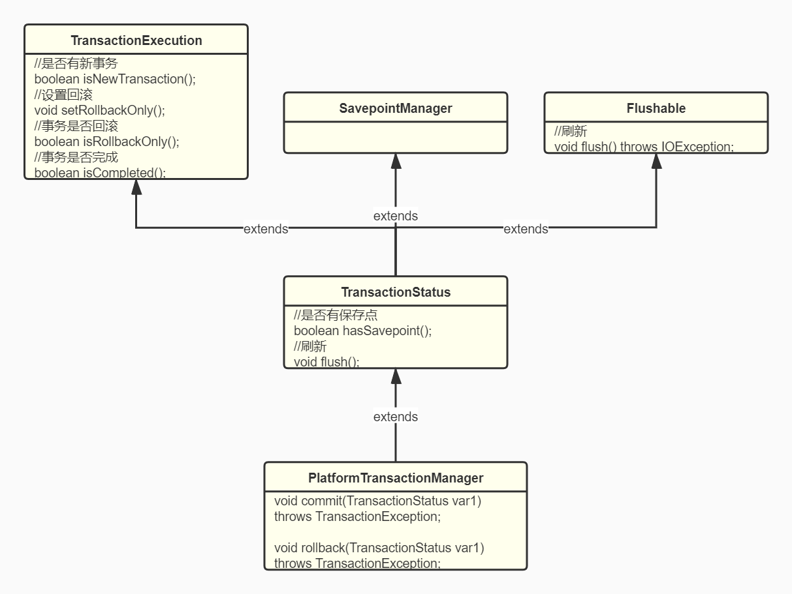

# Spring 的事务管理

## 1. PlatformTransactionManager 事务管理器

PlatformTransactionManager 接口是 Spring 的平台事务管理器，主要用于管理事务。该接口中提供了3个事务操作的方法，具体如下：

| 方法                                                         | 说明                 |
| ------------------------------------------------------------ | -------------------- |
| TransactionStatus getTransaction ( TransactionDefinition definition ) | 用于获取事务状态信息 |
| void commit ( TransactionStatus status )                     | 用于提交事务         |
| void rollback ( TransactionStatus status )                   | 用于回滚事务         |

**注意：**

- PlatformTransactionManager 是接口类型，不同的 Dao 层技术则有不同的实现类，例如：
- Dao 层技术是jdbc 或 mybatis 时：org.springframework.jdbc.datasource.DataSourceTransactionManager
- Dao 层技术是hibernate时：org.springframework.orm.hibernate5.HibernateTransactionManager

## 2. TransactionDefinìtion 基本事务属性的定义

事务属性可以理解成事务的一些基本配置，描述了事务策略如何应用到方法上。事务属性包含了5个方面，如图所示

TransactionDefinition 接口是事务定义(描述)的对象，该对象中定义了事务规则，并提供了获取事务相关信息的方法，具体如下：

| 方法                         | 说明               |
| ---------------------------- | ------------------ |
| String getName()             | 获取事务对象名称   |
| int getIsolationLevel()      | 获得事务的隔离级别 |
| int getPropogationBehavior() | 获得事务的传播行为 |
| int getTimeout()             | 获取事务的超时时间 |
| boolean isReadOnly()         | 获取事务是否只读   |

上述方法中，事务的传播行为是指在同一个方法中，不同操作前后所使用的事务。传播行为有很多种。

### 2.1 隔离级别：定义了一个事务可能受其他并发事务影响的程度。

并发事务引起的问题：在典型的应用程序中，多个事务并发运行，经常会操作相同的数据来完成各自的任务。并发虽然是必须的，但可能会导致以下的问题。

①、脏读（Dirty reads）——脏读发生在一个事务读取了另一个事务改写但尚未提交的数据时。如果改写在稍后被回滚了，那么第一个事务获取的数据就是无效的。

②、不可重复读（Nonrepeatable read）(虚读)——不可重复读发生在一个事务执行相同的查询两次或两次以上，但是每次都得到不同的数据时。这通常是因为另一个并发事务在两次查询期间进行了更新。

③、幻读（Phantom read）——幻读与不可重复读类似。它发生在一个事务（T1）读取了几行数据，接着另一个并发事务（T2）插入了一些数据时。在随后的查询中，第一个事务（T1）就会发现多了一些原本不存在的记录。

**注意：不可重复读重点是修改，而幻读重点是新增或删除。**

在 Spring 事务管理中，为我们定义了如下的隔离级别：

　　①、ISOLATION_DEFAULT：使用后端数据库默认的隔离级别

　　②、ISOLATION_READ_UNCOMMITTED：最低的隔离级别，允许读取尚未提交的数据变更，可能会导致脏读、幻读或不可重复读

　　③、ISOLATION_READ_COMMITTED：允许读取并发事务已经提交的数据，可以阻止脏读，但是幻读或不可重复读仍有可能发生

　　④、ISOLATION_REPEATABLE_READ：对同一字段的多次读取结果都是一致的，除非数据是被本身事务自己所修改，可以阻止脏读和不可重复读，但幻读仍有可能发生

　　⑤、ISOLATION_SERIALIZABLE：最高的隔离级别，完全服从ACID的隔离级别，确保阻止脏读、不可重复读以及幻读，也是最慢的事务隔离级别，因为它通常是通过完全锁定事务相关的数据库表来实现的
　　

### 2.2 传播行为：当事务方法被另一个事务方法调用时，必须指定事务应该如何传播。

Spring 定义了如下七中传播行为，这里以A业务和B业务之间如何传播事务为例说明：

　　①、PROPAGATION_REQUIRED ：required , 必须。默认值，A如果有事务，B将使用该事务；如果A没有事务，B将创建一个新的事务。

　　②、PROPAGATION_SUPPORTS：supports ，支持。A如果有事务，B将使用该事务；如果A没有事务，B将以非事务执行。

　　③、PROPAGATION_MANDATORY：mandatory ，强制。A如果有事务，B将使用该事务；如果A没有事务，B将抛异常。

　　④、PROPAGATION_REQUIRES_NEW ：requires_new，必须新的。如果A有事务，将A的事务挂起，B创建一个新的事务；如果A没有事务，B创建一个新的事务。

　　⑤、PROPAGATION_NOT_SUPPORTED ：not_supported ,不支持。如果A有事务，将A的事务挂起，B将以非事务执行；如果A没有事务，B将以非事务执行。

　　⑥、PROPAGATION_NEVER ：never，从不。如果A有事务，B将抛异常；如果A没有事务，B将以非事务执行。

　　⑦、PROPAGATION_NESTED ：nested ，嵌套。A和B底层采用保存点机制，形成嵌套事务。
　　

### 2.3 超时时间：默认值-1

为了使应用程序很好地运行，事务不能运行太长的时间。因为事务可能涉及对后端数据库的锁定，所以长时间的事务会不必要的占用数据库资源。事务超时就是事务的一个定时器，在特定时间内事务如果没有执行完毕，那么就会自动回滚，而不是一直等待其结束。

- 默认值是-1，没有超时限制。如果有，以秒为单位进行设置

### 2.4 只读：默认值false

这是事务的第三个特性，是否为只读事务。如果事务只对后端的数据库进行该操作，数据库可以利用事务的只读特性来进行一些特定的优化。通过将事务设置为只读，你就可以给数据库一个机会，让它应用它认为合适的优化措施。

- 建议查询时设置为只读

## 3. TransactionStatus 事务状态

这个方法返回的是 TransactionStatus对象，然后程序根据返回的对象来获取事务状态，然后进行相应的操作。
而 TransactionStatus 这个接口的内容如下：

这个接口描述的是一些处理事务提供简单的控制事务执行和查询事务状态的方法，在回滚或提交的时候需要应用对应的事务状态。

## 4. 事务管理的方式

- 编程式事务处理：所谓编程式事务指的是通过编码方式实现事务，允许用户在代码中精确定义事务的边界。即类似于JDBC编程实现事务管理。管理使用TransactionTemplate或者直接使用底层的PlatformTransactionManager。对于编程式事务管理，spring推荐使用TransactionTemplate。
- 声明式事务处理：管理建立在AOP之上的。其本质是对方法前后进行拦截，然后在目标方法开始之前创建或者加入一个事务，在执行完目标方法之后根据执行情况提交或者回滚事务。声明式事务最大的优点就是不需要通过编程的方式管理事务，这样就不需要在业务逻辑代码中掺杂事务管理的代码，只需在配置文件中做相关的事务规则声明(或通过基于@Transactional注解的方式)，便可以将事务规则应用到业务逻辑中。
- 简单地说，编程式事务侵入到了业务代码里面，但是提供了更加详细的事务管理；而声明式事务由于基于AOP，所以既能起到事务管理的作用，又可以不影响业务代码的具体实现。