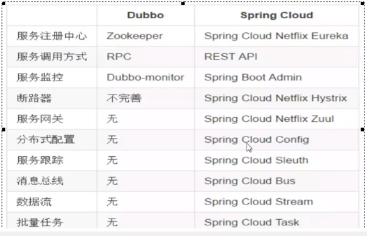

dubbo 是二进制传输，占用带宽会少一点。SpringCloud 是 http 传输，带宽会多一点，同时使用 http 协议一般会使用 JSON 报文，消耗会更大。

Spring Cloud 抛弃了 Dubbo 的 RPC 通信，采用的是基于 HTTP 的 REST 方式。

服务间的通信：

Dubbo，PRC的方式，底层采用Netty来实现，基于TCP建立的长连接

注意：BIO，NIO只是一种网络通信模式，BIO为每个连接创建一个线程，NIO一个线程服务多个连接；Netty封装了NIO，添加了主从处理组，BossGroup，WorkerGroup

编程模型：Reactor（反应堆）思想，NIO和Netty是其一种实现。

SpringCloud：使用Restful，http的方式，短连接的方式

性能：Dubbo>SpringCloud