## 1：创建父工程,pom 依赖

选择 Maven 自己的 3.5 以上的

约定>配置》编码

字符编码

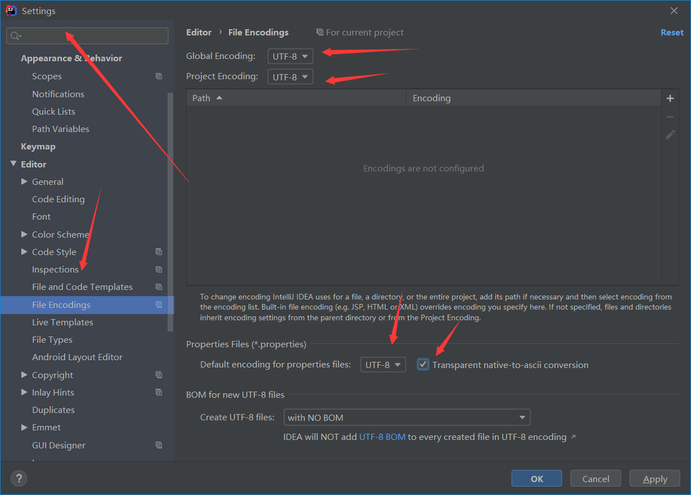

注解激活生效

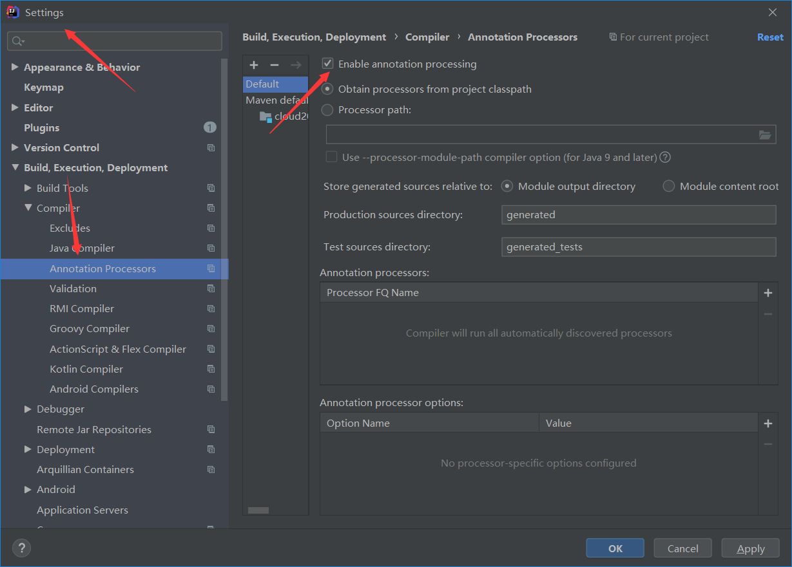

java 编译版本 8

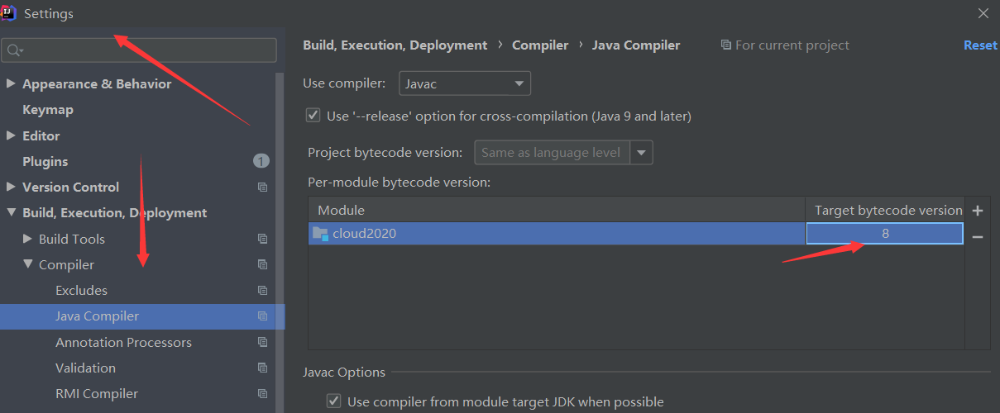

FileType 过滤，让一些文件不显示

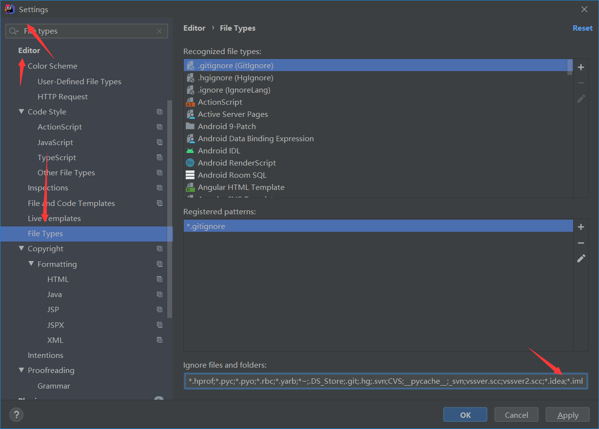

删掉 src 文件夹，只保留 pom.xml

跳过单元测试

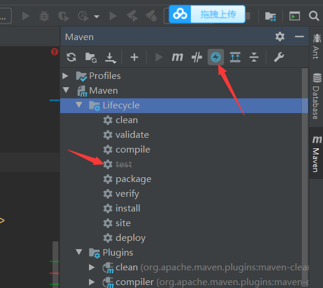

添加总的 jar 包

```xml
<!-- 统一管理jar包版本 -->
    <properties>
        <project.build.sourceEncoding>UTF-8</project.build.sourceEncoding>
        <maven.compiler.source>1.8</maven.compiler.source>
        <maven.compiler.target>1.8</maven.compiler.target>
        <junit.version>4.12</junit.version>
        <log4j.version>1.2.17</log4j.version>
        <lombok.version>1.16.18</lombok.version>
        <mysql.version>5.1.47</mysql.version>
        <druid.version>1.1.16</druid.version>
        <mybatis.spring.boot.version>1.3.0</mybatis.spring.boot.version>
    </properties>

    <!-- 子模块继承之后，提供作用：锁定版本+子modlue不用写groupId和version 只声明依赖，不不引入jar包 -->
    <dependencyManagement>
        <dependencies>
            <!--spring boot 2.2.2-->
            <dependency>
                <groupId>org.springframework.boot</groupId>
                <artifactId>spring-boot-dependencies</artifactId>
                <version>2.2.2.RELEASE</version>
                <type>pom</type>
                <scope>import</scope>
            </dependency>
            <!--spring cloud Hoxton.SR1-->
            <dependency>
                <groupId>org.springframework.cloud</groupId>
                <artifactId>spring-cloud-dependencies</artifactId>
                <version>Hoxton.SR1</version>
                <type>pom</type>
                <scope>import</scope>
            </dependency>
            <!--spring cloud alibaba 2.1.0.RELEASE-->
            <dependency>
                <groupId>com.alibaba.cloud</groupId>
                <artifactId>spring-cloud-alibaba-dependencies</artifactId>
                <version>2.1.0.RELEASE</version>
                <type>pom</type>
                <scope>import</scope>
            </dependency>
            <dependency>
                <groupId>mysql</groupId>
                <artifactId>mysql-connector-java</artifactId>
                <version>${mysql.version}</version>
            </dependency>
            <dependency>
                <groupId>com.alibaba</groupId>
                <artifactId>druid</artifactId>
                <version>${druid.version}</version>
            </dependency>
            <dependency>
                <groupId>org.mybatis.spring.boot</groupId>
                <artifactId>mybatis-spring-boot-starter</artifactId>
                <version>${mybatis.spring.boot.version}</version>
            </dependency>
            <dependency>
                <groupId>junit</groupId>
                <artifactId>junit</artifactId>
                <version>${junit.version}</version>
            </dependency>
            <dependency>
                <groupId>log4j</groupId>
                <artifactId>log4j</artifactId>
                <version>${log4j.version}</version>
            </dependency>
            <dependency>
                <groupId>org.projectlombok</groupId>
                <artifactId>lombok</artifactId>
                <version>${lombok.version}</version>
                <optional>true</optional>
            </dependency>
        </dependencies>
    </dependencyManagement>

    <build>
        <plugins>
            <plugin>
                <groupId>org.springframework.boot</groupId>
                <artifactId>spring-boot-maven-plugin</artifactId>
                <configuration>
                    <fork>true</fork>
                    <addResources>true</addResources>
                </configuration>
            </plugin>
        </plugins>
    </build>
```

## 2：创建子模块,pay 模块

实现

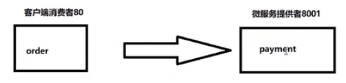

步骤

### 2.1：建 module

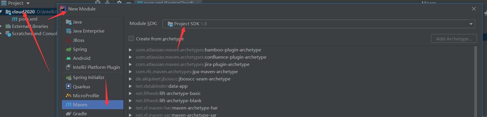

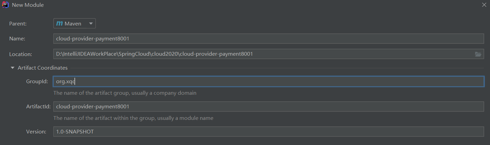

此时的父 pom 中已经自动加入了 module 的配置

```java
  <modules>
    <module>cloud-provider-payment8001</module>
  </modules>
```

### 2.2：pom 依赖

```xml
  <dependencies>
        <!--包含了sleuth+zipkin-->
        <dependency>
            <groupId>org.springframework.cloud</groupId>
            <artifactId>spring-cloud-starter-zipkin</artifactId>
        </dependency>
        <!--eureka-client-->
        <dependency>
            <groupId>org.springframework.cloud</groupId>
            <artifactId>spring-cloud-starter-netflix-eureka-client</artifactId>
        </dependency>
        <dependency>
            <groupId>org.springframework.boot</groupId>
            <artifactId>spring-boot-starter-web</artifactId>
        </dependency>
        <dependency>
            <groupId>org.springframework.boot</groupId>
            <artifactId>spring-boot-starter-actuator</artifactId>
        </dependency>
        <dependency>
            <groupId>org.mybatis.spring.boot</groupId>
            <artifactId>mybatis-spring-boot-starter</artifactId>
        </dependency>
        <dependency>
            <groupId>com.alibaba</groupId>
            <artifactId>druid-spring-boot-starter</artifactId>
            <version>1.1.10</version>
        </dependency>
        <!--mysql-connector-java-->
        <dependency>
            <groupId>mysql</groupId>
            <artifactId>mysql-connector-java</artifactId>
        </dependency>
        <!--jdbc-->
        <dependency>
            <groupId>org.springframework.boot</groupId>
            <artifactId>spring-boot-starter-jdbc</artifactId>
        </dependency>
        <dependency>
            <groupId>org.springframework.boot</groupId>
            <artifactId>spring-boot-devtools</artifactId>
            <scope>runtime</scope>
            <optional>true</optional>
        </dependency>
        <dependency>
            <groupId>org.projectlombok</groupId>
            <artifactId>lombok</artifactId>
            <optional>true</optional>
        </dependency>
        <dependency>
            <groupId>org.springframework.boot</groupId>
            <artifactId>spring-boot-starter-test</artifactId>
            <scope>test</scope>
        </dependency>
    </dependencies>

```

### 2.3：创建 application.yml

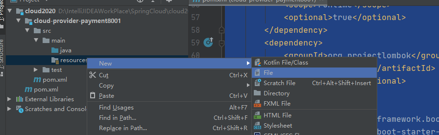

一定要变成树叶的标志，如果没有：

https://blog.csdn.net/qq_42449963/article/details/105518286

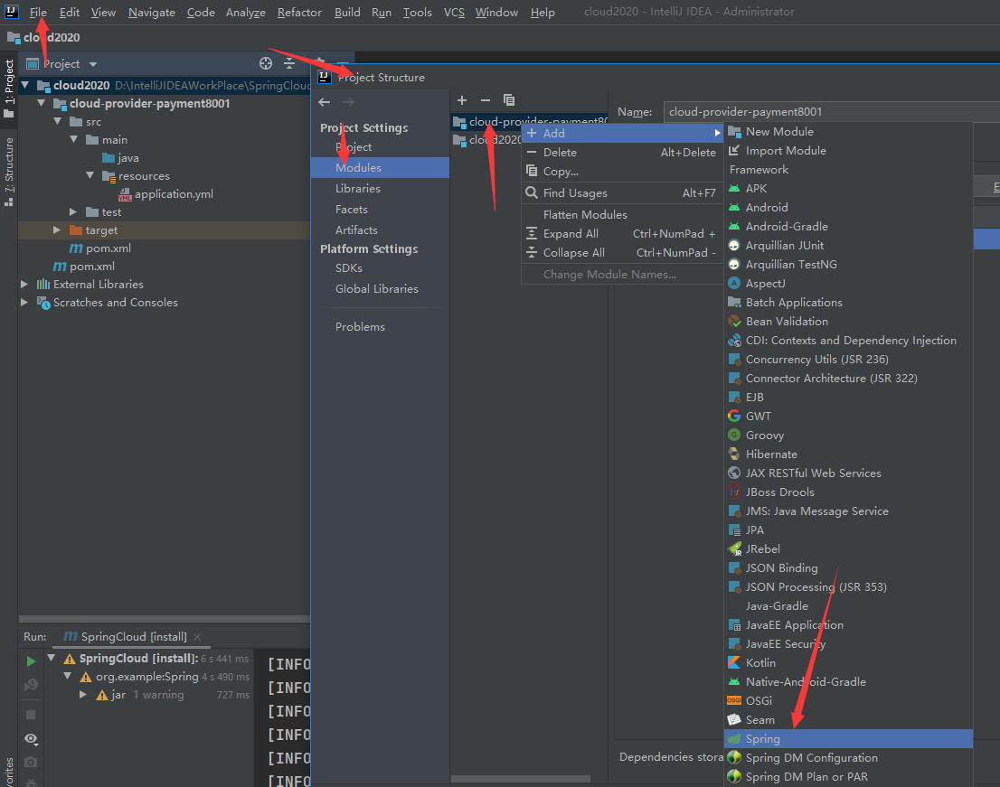

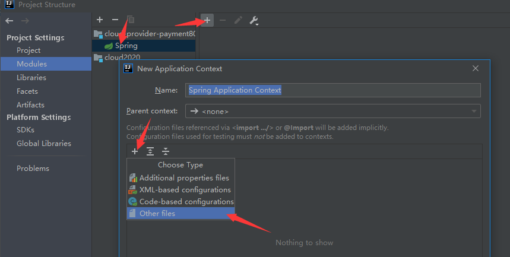

如果还不行，就 maven clean 一下，应该是 spring 的 jar 包没导入

```yml
server:
	port: 8001
spring:
	application:
		name: cloud-payment-service
	datasource:
    # 当前数据源操作类型
    type: com.alibaba.druid.pool.DruidDataSource
    # mysql驱动类
    driver-class-name: com.mysql.cj.jdbc.Driver
      url: jdbc:mysql://localhost:3306/db2019?useUnicode=true&characterEncoding=
            UTF-8&useSSL=false&serverTimezone=GMT%2B8
    username: root
    password: 123456
mybatis:
    mapper-locations: classpath*:mapper/*.xml
   	type-aliases-package: com.atguigu.springcloud.entities
   			它一般对应我们的实体类所在的包，这个时候会自动取对应包中不包括包名的简单类名作为包括包名的别名。多个package之间可以用逗号或者分号等来进行分隔（value的值一定要是包的全）
```

### 2.4：主启动类

```java
@SpringBootApplication
public class PaymentMain8001 {

    public static void main(String[] args) {
        SpringApplication.run(PaymentMain8001.class,args);
   }
}
```

### 2.5：业务类

1：sql

```sql
CREATE DATABASE `db2019`;

USE `db2019`;

DROP TABLE IF EXISTS `payment`;

CREATE TABLE `payment` (
  `id` BIGINT(20) NOT NULL AUTO_INCREMENT COMMENT 'ID',
  `serial` VARCHAR(200) DEFAULT '',
  PRIMARY KEY (`id`)
) ENGINE=INNODB DEFAULT CHARSET=utf8;
```

2：实体类

Payment

```java
//引入lombok，不再写get和set方法
@Data
//对全部参数应用get和set
@AllArgsConstructor
//空参数
@NoArgsConstructor
//序列化
public class Payment implements Serializable {
    private Long id;
    private String serial;
}
```

前端返回实体

```java
//引入lombok，不再写get和set方法
@Data
//对全部参数应用get和set
@AllArgsConstructor
//空参数
@NoArgsConstructor
//序列化
/**
 * 返回前端的数据通用类
 */
public class CommonResult<T> {
    private Integer code;
    private String message;
    private T data;

    public CommonResult(Integer code,String message)
    {
        this(code,message,null);
    }

}
```

报错是因为没有安装 lombok 插件

4,dao 层:

```java
@Mapper
public interface PaymentDao {

    public int create(Payment payment);

    public Payment getPaymentById(@Param("id") Long id);
}
```

5,mapper 配置文件类

在 resource 下创建 directory 目录 mapper，创建 File 为 PaymentMapper.xml

```xml
<?xml version="1.0" encoding="UTF-8" ?>
<!DOCTYPE mapper PUBLIC "-//mybatis.org//DTD Mapper 3.0//EN" "http://mybatis.org/dtd/mybatis-3-mapper.dtd" >

<mapper namespace="com.atguigu.springcloud.dao.PaymentDao">

    <insert id="create" parameterType="Payment" useGeneratedKeys="true" keyProperty="id">
        insert into payment(serial)  values(#{serial});
    </insert>

    <resultMap id="BaseResultMap" type="com.atguigu.springcloud.entities.Payment">
        <id column="id" property="id" jdbcType="BIGINT"/>
        <id column="serial" property="serial" jdbcType="VARCHAR"/>
    </resultMap>
    <select id="getPaymentById" parameterType="Long" resultMap="BaseResultMap">
        select * from payment where id=#{id};
    </select>

</mapper>

```

6：写 service 和 serviceImpl

```java
@Service
public class PaymentServiceImpl implements PaymentService
{
    @Resource
    private PaymentDao paymentDao;
    public int create(Payment payment){
    	return paymentDao.create(payment) ;
    }
    public Payment getPaymentById( Long id){
    	return paymentDao.getPaymentById(id);
    }

}
```

7：controller

```java
@Restcontroller
@Slf4j
public class PaymentController{
    @Resource
	private Paymentservice paymentservice;
	@PostMapping(value = "/ payment/ create" )
	public CommonResult create(Payment payment){
        int result = paymentservice.create(payment);
        log.info("*****插入结果:"+result);
        if(result > o)
        {
        	return new commonResult( code: 20o,message:"插入数据库成功" ,result);
        }else{
        	return new CommonResult( code: 444,message:"插入数据库失败" , data: null);
        }
        @GetMapping(value = "/ payment/get/{id}")
        public CommonResult getPaymentById(@Pathvariable("id") Long id){
        	Payment payment = paymentservice.getPaymentById(id);log.info( "*****插入结果:"+payment);
        	if(payment != nul1)
        	{
        		return new CommonResult( code: 200,message: "查询成功" , payment);
            }else{
        		return new CommonResult( code: 444,message: "没有对应记录,大败" , data: null);
            }
		}
    }
    @GetMapping(value = "/payment/get/{id}")
	public CommonResult getpaymentById(@Pathvariable("id") Long id){
        Payment payment = paymentservice.getPaymentById(id);log.info("*****插入结果:"+payment);
        if(payment != null)
        {
        	return new CommonResult( code: 200,message: "查询成功" , payment);
        }else{
        	return new CommonResult( code: 444,message: "没有对应记录,大败", data: null);
        }


```


## 3：热部署

module 中添加插件：

```xml
        <!--自动热部署开发工具-->
        <dependency>
            <groupId>org.springframework.boot</groupId>
            <artifactId>spring-boot-devtools</artifactId>
            <scope>runtime</scope>
            <optional>true</optional>
        </dependency>
```

父工程中添加

```xml
    <build>
        <plugins>
            <plugin>
                <groupId>org.springframework.boot</groupId>
                <artifactId>spring-boot-maven-plugin</artifactId>
                <configuration>
                    <fork>true</fork>
                    <addResources>true</addResources>
                </configuration>
            </plugin>
        </plugins>
    </build>
```

开启自动编译的选项

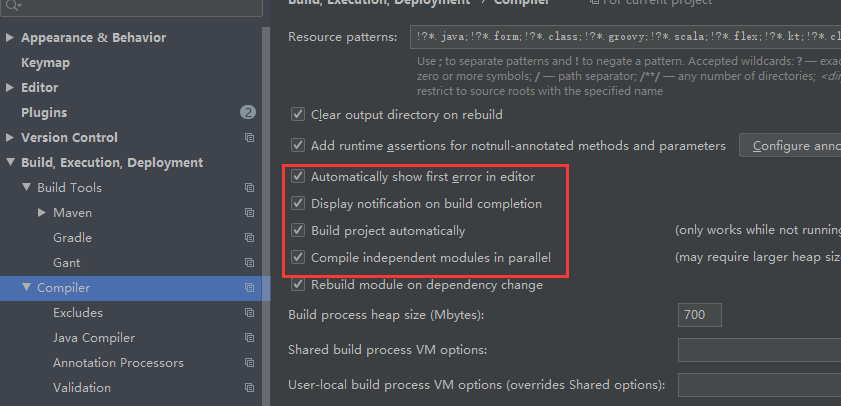

在父 pom.xml 中按 Ctrl + Shift + Alt + /点击 Registry

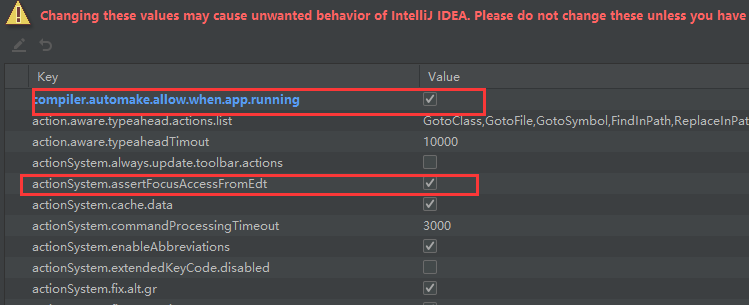

如果遇到这个错误不用管，这是阿里犯的错


## 4：order 模块

1：建 moudle

2：改 pom

3：写 yml

```xml
server
	port:80
```

4：主启动类

```java
@SpringBootApplication
@EnableDiscoveryClient
public class OrderZKMain80
{
    public static void main(String[] args) {
            SpringApplication.run(OrderZKMain80.class, args);
    }
}
```

5：业务类

controller 类

因为这里是消费者类,主要是消费,那么就没有 service 和 dao,需要调用 pay 模块的方法。并且这里还没有微服务的远程调用,那么如果要调用另外一个模块,则需要使用基本的 api 调用

使用 RestTemplate 调用 pay 模块，RestTemplate提供了多种便捷访问远程Http服务的方法，是一种简单便捷的访问restful服务模板类，是Spring提供的用于访问Rest服务的客户端模板工具集。

使用：

使用restTemplate访问restful接口非常的简单粗暴无脑。(url, requestMap, ResponseBean.class)这三个参数分别代表REST请求地址、请求参数、HTTP响应转换被转换成的对象类型。

使用配置类将 restTemplate 注入到容器

```java
@Configuration
public class ApplicationContextConfig
{
    //依赖注入
    @Bean
    public RestTemplate getRestTemplate()
    {
        return new RestTemplate();
    }
}
```

编写 controller

```java
@Restcontroller
@slf4j
public class ordercontroller{
    public static final string PAYMENT_URL = "http://localhost:8001";
    @Resource
    private RestTemplate restTemplate;
    @GetMapping( "/consumer/payment/create")
    public CommonResult<Payment> create(Payment payment){
    	return restTemplate.postForobject(url:PAYMENT_URL +"/payment/create" ,payment , commonResult.class);
    }
    @GetMapping("/consumer/payment/get/{id”)
    public commonResult<Payment> getPayment(@Pathvariable("id") Long id){
        return restTemplate.getForobject( url:PAYMENT_URL+"/payment/get/"+id,CommonResult.class);
    }
                }
```

测试启动两个服务，访问消费者路径

localhost/consumer/payment/get/31

注意：在提供者模块不要忘记@RequestBody 对于参数

运行窗口：Run DashBoard

    <option name="configurationTypes">
    	<set>
    		<option value="SpringBootApplicationConfigurationType/>
    	</set>
    </option>

## 5：重构,

新建一个模块,将重复代码抽取到一个公共模块中

### 5.1,创建 commons 模块

### 5.2 抽取公共 pom

```xml
    <dependencies>
        <dependency>
            <groupId>org.springframework.boot</groupId>
            <artifactId>spring-boot-devtools</artifactId>
            <scope>runtime</scope>
            <optional>true</optional>
        </dependency>
        <dependency>
            <groupId>org.projectlombok</groupId>
            <artifactId>lombok</artifactId>
            <optional>true</optional>
        </dependency>
        <!--hut工具包，对时间格式有很好的支持-->
        <dependency>
            <groupId>cn.hutool</groupId>
            <artifactId>hutool-all</artifactId>
            <version>5.1.0</version>
        </dependency>
    </dependencies>
```

### 5.3：entity 和实体类放入 commons 中

### 5.4：使用 mavne,将 commone 模块打包(install),

删除原有模块的实体类

其他模块引入 commons