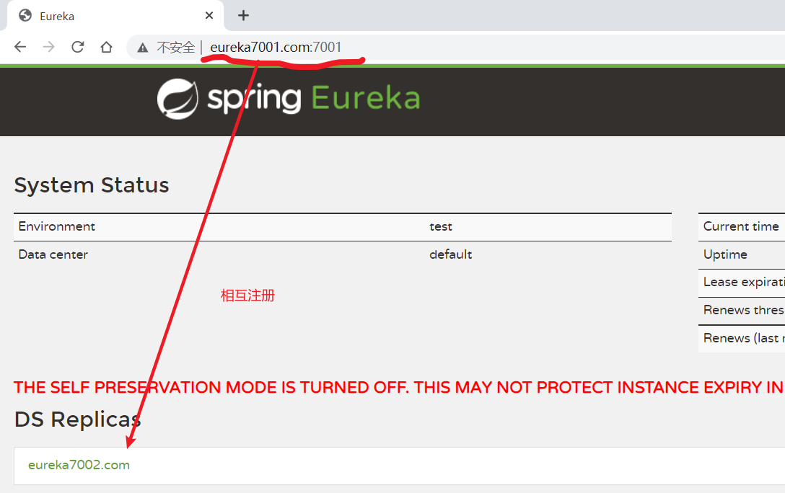

当服务很多时,单靠代码手动管理是很麻烦的,需要一个公共组件,统一管理多服务,包括服务是否正常运行,等

Eureka 用于**==服务注册==**,目前官网**已经停止更新**

**服务治理**

管理服务与服务之间的依赖关系，可以实现服务调用，负载均衡，容错等，实现服务发现与注册

**服务注册与发现**

Eureka 采用 CS 的设计架构，EurekaServer 作为服务注册功能的服务器，它是服务注册中心，而系统中的其他微服务，使用 Eureka 的客户端连接到 Eureka Server 并维持心跳连接。


Eureka 包含两个组件：EurekaServer 和 EurekaClient

EurekaServer 提供服务注册服务：EurekaServer 中服务注册表中将会存储所有可用服务节点的信息，服务节点的信息可以在界面中直观看到。

EurekaClient 通过注册中心进行访问：Java 客户端，具备一个内置的，使用轮询负载算法的负载均衡器。在启动后，将会向 EurekaServer 发送心跳（默认周期为 30 秒）。如果 EurekaServer 在多个心跳周期内没有接收到某个节点的心跳。将会从服务注册表中把这个服务节点移除（默认 90 秒）

# 原理

**客户端启动时如何注册到服务端？**

Eureka 客户端在启动时，首先会创建一个心跳的定时任务，定时向服务端发送心跳信息，服务端会对客户端心跳做出响应，如果响应状态码为 404 时，表示服务端没有该客户端的服务信息，那么客户端则会向服务端发送注册请求，注册信息包括服务名、ip、端口、唯一实例 ID 等信息。

**服务端如何保存客户端服务信息？**

客户端通过 Jersey 框架（亚马逊的一个 http 框架）将服务实例信息发送到服务端，服务端将客户端信息放在一个 ConcurrentHashMap 对象中。

**客户端如何拉取服务端已保存的服务信息？**

客户端拉取服务端服务信息是通过一个定时任务定时拉取的，每次拉取后刷新本地已保存的信息，需要使用时直接从本地直接获取。

**心跳与服务剔除机制？**

心跳机制：

- 客户端启动后，就会启动一个定时任务，定时向服务端发送心跳数据，告知服务端自己还活着，默认的心跳时间间隔是 30 秒。

服务剔除机制：

- 如果开启了自我保护机制，那么所有的服务，包括长时间没有收到心跳的服务（即已过期的服务）都不会被剔除；
- 如果未开启自我保护机制，那么将判断最后一分钟收到的心跳数与一分钟收到心跳数临界值（计算方法参考 5.1 节）比较，如果前者大于后者，且后者大于 0 的话，则启用服务剔除机制；
- 一旦服务剔除机制开启，则 Eureka 服务端并不会直接剔除所有已过期的服务，而是通过随机数的方式进行剔除，避免自我保护开启之前将所有的服务（包括正常的服务）给剔除。

# 1：**单机版 Eureka:**

## **1.1创建项目New Module**

单独用于注册到 Eureka中

名字：cloud_eureka_server7001

## **1.2引入 pom 依赖**

eurka 最新的依赖变了，服务端引用下边的

```xml
<!--老版本-->
<dependency>
    <groupId>org.springframework.cloud</groupId>
    <artifactId>spring-cloud-starter-eureka</artifactId>
</dependency>
<!--新版本-->
<dependency>
    <groupId>org.springframework.cloud</groupId>
    <artifactId>spring-cloud-starter-neflix-eureka-server</artifactId>
</dependency>


<dependencies>
        <!--eureka-server-->
        <dependency>
            <groupId>org.springframework.cloud</groupId>
            <artifactId>spring-cloud-starter-netflix-eureka-server</artifactId>
        </dependency>
        <!-- 引入自己定义的api通用包，可以使用Payment支付Entity -->
        <dependency>
            <groupId>com.atguigu.springcloud</groupId>
            <artifactId>cloud-api-commons</artifactId>
            <version>1.0-SNAPSHOT</version>
        </dependency>
        <!--boot web actuator-->
        <dependency>
            <groupId>org.springframework.boot</groupId>
            <artifactId>spring-boot-starter-web</artifactId>
        </dependency>
        <dependency>
            <groupId>org.springframework.boot</groupId>
            <artifactId>spring-boot-starter-actuator</artifactId>
        </dependency>
        <!--一般通用配置-->
        <dependency>
            <groupId>org.springframework.boot</groupId>
            <artifactId>spring-boot-devtools</artifactId>
            <scope>runtime</scope>
            <optional>true</optional>
        </dependency>
        <dependency>
            <groupId>org.projectlombok</groupId>
            <artifactId>lombok</artifactId>
        </dependency>
        <dependency>
            <groupId>org.springframework.boot</groupId>
            <artifactId>spring-boot-starter-test</artifactId>
            <scope>test</scope>
        </dependency>
        <dependency>
            <groupId>junit</groupId>
            <artifactId>junit</artifactId>
        </dependency>
    </dependencies>
```

## 1.3配置文件application.yml

```yml
server:
  port: 7001

eureka:
  instance:
    hostname: eureka7001.com #eureka服务端的实例名称
  client:
    register-with-eureka: false #false表示不向注册中心注册自己。
    fetch-registry: false #false表示自己端就是注册中心，我的职责就是维护服务实例，并不需要去检索服务
    service-url:
      #集群指向其它eureka
      #defaultZone: http://eureka7002.com:7002/eureka/
      #单机就是7001自己
      defaultZone: http://eureka7001.com:7001/eureka/
  #server:
  #关闭自我保护机制，保证不可用服务被及时踢除
  #enable-self-preservation: false
  #eviction-interval-timer-in-ms: 2000
```

## 1.4主启动类（Eureka服务不向注册中心注册自己）

```java
@SpringBootApplication
@EnableEurekaServer
public class EurekaMain7001
{
    public static void main(String[] args) {
            SpringApplication.run(EurekaMain7001.class, args);
    }
}
```

## 1.5测试

打开：localhost:7001

即可查看Eureka页面


# **2：创建payment生产者模块注册到 Eureka**

## 2.1创建项目New Module

单独用于注册到 Eureka 中

名字 ：cloud-provider-payment8001

## 2.2 pom依赖引入

```xml
<!--eureka-client,引入client的依赖-->
<dependency>
    <groupId>org.springframework.cloud</groupId>
    <artifactId>spring-cloud-starter-neflix-eureka-client</artifactId>
</dependency>
```

## 2.3配置文件application.yml

```yml
server:
  port: 8001

spring:
  application:
    name: cloud-provider-payment
  datasource:
    type: com.alibaba.druid.pool.DruidDataSource            # 当前数据源操作类型
    driver-class-name: org.gjt.mm.mysql.Driver              # mysql驱动包
    url: jdbc:mysql://localhost:3306/db2019?useUnicode=true&characterEncoding=utf-8&useSSL=false
    username: root
    password: 123456

eureka:
  client:
    #表示是否将自己注册进EurekaServer默认为true。
    register-with-eureka: true
    #是否从EurekaServer抓取已有的注册信息，默认为true。单节点无所谓，集群必须设置为true才能配合ribbon使用负载均衡
    fetchRegistry: true
    service-url:
      #单机版
      #defaultZone: http://localhost:7001/eureka
      # 集群版
      defaultZone: http://eureka7001.com:7001/eureka,http://eureka7002.com:7002/eureka
  instance:
    instance-id: payment8001
    #访问路径可以显示IP地址
    prefer-ip-address: true
    #Eureka客户端向服务端发送心跳的时间间隔，单位为秒(默认是30秒)
    lease-renewal-interval-in-seconds: 1
    #Eureka服务端在收到最后一次心跳后等待时间上限，单位为秒(默认是90秒)，超时将剔除服务
    lease-expiration-duration-in-seconds: 2

mybatis:
  mapperLocations: classpath:mapper/*.xml
  type-aliases-package: com.atguigu.springcloud.entities    # 所有Entity别名类所在包
```

## 2.4主启动类注册到 Eureka中

```java
@SpringBootApplication
@EnableEurekaClient
public class PaymentMain8001{
    public static void main(String[] args){
        SpringApplication.run()
    }
}
```


# 3：集群版 Eureka

## 集群原理


```java
1,就是pay模块启动时,注册自己,并且自身信息也放入eureka
2.order模块,首先也注册自己,放入信息,当要调用pay时,先从eureka拿到pay的调用地址
3.通过HttpClient调用
	并且还会缓存一份到本地,每30秒更新一次
```

问：微服务 RPC 远程调用最核心的是什么？

高可用：要是注册中心坏了，就直接崩溃，可以搭建 Eureka 注册中心集群。

## **集群构建原理:**

互相注册


## **3.1创建项目New Module**

单独用于注册到 Eureka中

名字：cloud_eureka_server7002

## 3.2pom 依赖引入

eurka 最新的依赖变了，服务端引用下边的

```xml
<!--老版本-->
<dependency>
    <groupId>org.springframework.cloud</groupId>
    <artifactId>spring-cloud-starter-eureka</artifactId>
</dependency>
<!--新版本-->
<dependency>
    <groupId>org.springframework.cloud</groupId>
    <artifactId>spring-cloud-starter-neflix-eureka-server</artifactId>
</dependency>


<dependencies>
        <!--eureka-server-->
        <dependency>
            <groupId>org.springframework.cloud</groupId>
            <artifactId>spring-cloud-starter-netflix-eureka-server</artifactId>
        </dependency>
        <!-- 引入自己定义的api通用包，可以使用Payment支付Entity -->
        <dependency>
            <groupId>com.atguigu.springcloud</groupId>
            <artifactId>cloud-api-commons</artifactId>
            <version>1.0-SNAPSHOT</version>
        </dependency>
        <!--boot web actuator-->
        <dependency>
            <groupId>org.springframework.boot</groupId>
            <artifactId>spring-boot-starter-web</artifactId>
        </dependency>
        <dependency>
            <groupId>org.springframework.boot</groupId>
            <artifactId>spring-boot-starter-actuator</artifactId>
        </dependency>
        <!--一般通用配置-->
        <dependency>
            <groupId>org.springframework.boot</groupId>
            <artifactId>spring-boot-devtools</artifactId>
            <scope>runtime</scope>
            <optional>true</optional>
        </dependency>
        <dependency>
            <groupId>org.projectlombok</groupId>
            <artifactId>lombok</artifactId>
        </dependency>
        <dependency>
            <groupId>org.springframework.boot</groupId>
            <artifactId>spring-boot-starter-test</artifactId>
            <scope>test</scope>
        </dependency>
        <dependency>
            <groupId>junit</groupId>
            <artifactId>junit</artifactId>
        </dependency>
    </dependencies>
```

## 3.3配置文件application.yml

在写配置文件前,修改一下主机的 C:\Windows\System32\drivers\etchosts 文件


首先修改之前的 7001 的 eureka 项目，因为多个 eureka 需要互相注册

```yml
server:
  port: 7001

eureka:
  instance:
    hostname: eureka7001.com #eureka服务端的实例名称
  client:
    register-with-eureka: false     #false表示不向注册中心注册自己。
    fetch-registry: false     #false表示自己端就是注册中心，我的职责就是维护服务实例，并不需要去检索服务
    service-url:
      #单机就是7001自己,集群指向其它eureka
      #defaultZone: http://eureka7001.com:7001/eureka/
      defaultZone: http://eureka7002.com:7002/eureka/
  server:
    #关闭自我保护机制，保证不可用服务被及时踢除
    #enable-self-preservation: false
    #eviction-interval-timer-in-ms: 2000
```

然后修改 7002，7002 也是一样的，只不过端口和地址改一下

```yaml
server:
  port: 7002

eureka:
  instance:
    hostname: eureka7002.com #eureka服务端的实例名称
  client:
    register-with-eureka: false     #false表示不向注册中心注册自己。
    fetch-registry: false     #false表示自己端就是注册中心，我的职责就是维护服务实例，并不需要去检索服务
    service-url:
      #单机就是7001自己,集群指向其它eureka
      defaultZone: http://eureka7001.com:7001/eureka/
      #defaultZone: http://eureka7002.com:7002/eureka/
    #server:
    #关闭自我保护机制，保证不可用服务被及时踢除
    #enable-self-preservation: false
    #eviction-interval-timer-in-ms: 2000
```

## 3.4主启动类（Eureka服务不向注册中心注册自己）

```java
@SpringBootApplication
@EnableEurekaServer
public class EurekaMain7002 {
    public static void main(String[] args) {
        SpringApplication.run(EurekaMain7002.class, args);
    }
}
```

## 3.5然后启动 7001,7002 即可



# 4：将 payment,order 模块注册到 eureka 集群中:

1,只需要修改配置文件即可

```yml
eureka:
    client:
    #表示是否将自己注册进EurekaServer默认为true 
    register-with-eureka: true
    #是否从EurekaServer抓取已有的注册信息，默认为true。单节点无所谓，集群必须没置为true才能配合ribbon使用负载均衡
    fetchRegistry: true
    	service-ur1:
    	#tdefaultZone: http://localhost:7001/eureka改这一条即可,添加多个eureka地址
    	defaultZone: http://eureka7001.com:7001/eureka,http:/ /eureka7002.com:7002/eureka #集群版
```

2,两个模块都修改上面的都一样即可

然后启动两个模块

要先启动 7001,7002,然后是 pay 模块 8001,然后是 order(80)

# 5：将 pay 模块也配置为集群模式:

0,创建新模块,8002

名称: cloud_pay_8002

1,pom 文件,复制 8001 的

2,pom 文件复制 8001 的

3,配置文件复制 8001 的

端口修改一下,改为 8002

服务名称不用改,用一样的

4.主启动类,复制 8001 的

5,mapper,service,controller 都复制一份

然后就启动服务即可

此时访问 order 模块,发现并没有负载均衡到两个 pay,模块中,而是只访问 8001

虽然我们是使用 RestTemplate 访问的微服务,但是也可以负载均衡的


**注意这样还不可以,需要让 RestTemplate 开启负载均衡注解,还可以指定负载均衡算法,默认轮询**


# 6：修改服务主机名和 ip 在 eureka 的 web 上显示

比如修改 pay 模块

1,修改配置文件:

添加实例


# 7：服务发现 Discovery

对于注册进 Eureka 里面的微服务，可以铜鼓服务发现来了获得该服务的信息。

以 pay 模块为例

**1,首先添加一个注解,在 controller 中**


**2,在主启动类上添加一个注解**


**然后重启 8001.访问/payment/discover**y

# 8：Eureka 自我保护:


概述
保护模式主要用于一组客户端与 Euraka Server 之间存在网络分区场景下的保护，一旦进入保护模式：**Eureka Server 将会尝试保护其服务注册表中的信息，不再删除服务注册表中的数据，也就是不会注销任何微服务**

一句话：某时刻某一个微服务不可用了，Eureka 不会立即清理。依旧会对该微服务新的进行保存，属于 CAP 里面的 AP 分支。

为什么会产生 Eureka 的自我保护机制？

为了防止 EurekaClient 可以正常运行，但是与 EurekaServer 网络不通情况下，EurekaServer 不会立即将 EurekaClient 服务剔除

什么是自我保护模式？

默认情况下，如果 EurekaServer 在一定时间内没有收到某个微服务实例的心跳，EurekaServer 将会注销该实例（默认 90 秒）。但是当网络分区故障发生（延时，卡顿，拥挤）时，微服务与 EurekaServer 之间无法正常通信，以上行为可能变得危险了——因为微服务本身其实是健康的，此时不应该注销这个微服务，EUreka 通过自我保护来解决这个问题——当 EurekaServer 节点在短时间内丢失过多客户端时（可能发生了网络分区故障）那么这个节点就会进入自我保护模式。

**eureka 服务端配置:**

出厂默认。自我保护机制开启：

eureka.server.enable-self-proservation = false 可以禁用自我保护机制

evicition-interval-timer-in-ms2000

**设置接受心跳时间间隔**

客户端(比如 pay 模块):


此时启动 erueka 和 pay.此时如果直接关闭了 pay,那么 erueka 会直接删除其注册信息