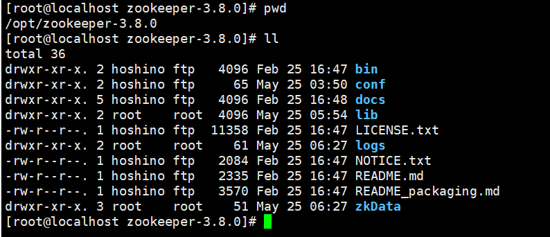
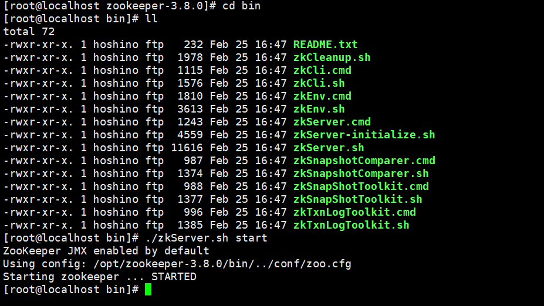
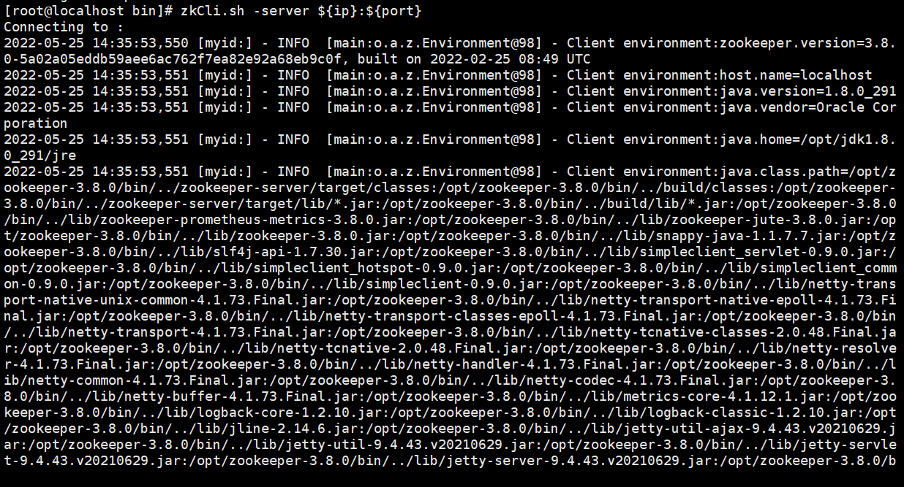
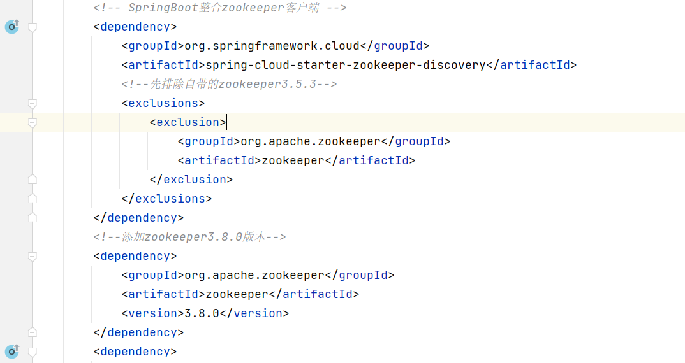

# 1. 在Linux上启动ZooKeeper

> Linux下安装zookeeper教程https://blog.csdn.net/zhang_m_h/article/details/123682877

## 1.1 服务启动：

```
进入zookeeper的源码目录下:
cd /opt/zookeeper-3.8.0/bin
```



```
服务管理命令:
zkServer.sh start|stop|restart|status
```



## 1.2 客户端连接：

```
zkCli.sh -server ${ip}:${port}
```




# 2. 创建payment生产者8004模块注册到 ZK

## 2.1 创建项目New Module

单独用于注册到 ZooKeeper 中

名字 ：cloud-providerZooKeeper-payment8004

## 2.2 pom依赖引入

```xml
<dependencies>
    <!-- SpringBoot整合Web组件 -->
    <dependency>
        <groupId>org.springframework.boot</groupId>
        <artifactId>spring-boot-starter-web</artifactId>
    </dependency>
    <dependency><!-- 引入自己定义的api通用包，可以使用Payment支付Entity -->
        <groupId>com.atguigu.springcloud</groupId>
        <artifactId>cloud-api-commons</artifactId>
        <version>${project.version}</version>
    </dependency>
    <!-- SpringBoot整合zookeeper客户端 -->
    <dependency>
        <groupId>org.springframework.cloud</groupId>
        <artifactId>spring-cloud-starter-zookeeper-discovery</artifactId>
        <!--先排除自带的zookeeper3.5.3-->
        <exclusions>
            <exclusion>
                <groupId>org.apache.zookeeper</groupId>
                <artifactId>zookeeper</artifactId>
            </exclusion>
        </exclusions>
    </dependency>
    <!--添加zookeeper3.8.0版本-->
    <dependency>
        <groupId>org.apache.zookeeper</groupId>
        <artifactId>zookeeper</artifactId>
        <version>3.8.0</version>
    </dependency>
    <dependency>
        <groupId>org.springframework.boot</groupId>
        <artifactId>spring-boot-devtools</artifactId>
        <scope>runtime</scope>
        <optional>true</optional>
    </dependency>
    <dependency>
        <groupId>org.projectlombok</groupId>
        <artifactId>lombok</artifactId>
        <optional>true</optional>
    </dependency>
    <dependency>
        <groupId>org.springframework.boot</groupId>
        <artifactId>spring-boot-starter-test</artifactId>
        <scope>test</scope>
    </dependency>
</dependencies>
```

## 2.3 配置文件application.yml

```yaml
#8004表示注册到zookeeper服务器的支付服务提供者端口号
server:
  port: 8004

#服务别名----注册zookeeper到注册中心名称
spring:
  application:
    name: cloud-provider-payment
  cloud:
    zookeeper:
      connect-string: 192.168.48.129:2181
```

## 2.4 主启动类注册到ZooKeeper中

```java
@SpringBootApplication
@EnableDiscoveryClient
public class PaymentMain8004 {
    public static void main(String[] args) {
        SpringApplication.run(PaymentMain8004.class, args);
    }
}
```

## 2.5 Controller

```java
@RestController
@Slf4j
public class PaymentController {

    @Value("${server.port}")
    private String serverPort;

    @RequestMapping(value = "/payment/zk")
    public String paymentzk() {
        return "springcloud with zookeeper: "+serverPort+"\t"+ UUID.randomUUID().toString();
    }
}
```

## 2.6 关于zk版本错误问题

**此时启动,会报错,因为 jar 包与我们的 zk 版本不匹配**

解决:
修改 pom 文件,改为与我们 zk 版本匹配的 jar 包



**此时 8003 就注册到 zk 中了**

```java
我们在zk上注册的node是临时节点,当我们的服务一定时间内没有发送心跳

那么zk就会`将这个服务的node删除了
```

**这里测试,就不写 service 与 dao 什么的了**


# 3. 创建order消费者80模块注册到 ZK

## 3.1 创建项目New Module

单独用于注册到 zk 中

名字：cloud-consumerzk-order80

## 3.2 pom依赖引入(与生产者模块相同的依赖)

## 3.3 配置文件application.yml

```yaml
#8004表示注册到zookeeper服务器的支付服务提供者端口号
server:
  port: 80

#服务别名----注册zookeeper到注册中心名称
spring:
  application:
    name: cloud-consumer-order
  cloud:
    zookeeper:
      connect-string: 192.168.48.129:2181
```

## 3.4 主启动类注册到ZooKeeper中

```java
@SpringBootApplication
@EnableDiscoveryClient
public class orderZKMain80 {
    public static void main(String[] args) {
        SpringApplication.run(orderZKMain80.class, args);
    }
}
```

## 3.5 配置Bean（RestTemolate）

```java
@Configuration
public class ApplicationContextConfig {

    @Bean
    @LoadBalanced
    public RestTemplate restTemplate() {
        return new RestTemplate();
    }
}
```

## 3.6 Controller

```java
@RestController
@Slf4j
public class OrderZKController {
    public static final String INVOKE_URL = "http://cloud-provider-payment";

    @Resource
    private RestTemplate restTemplate;

    @RequestMapping(value = "/consumer/payment/zk")
    public String paymentInfo() {
        String result = restTemplate.getForObject(INVOKE_URL + "/payment/zk", String.class);
        return result;
    }
}
```

## 3.7 测试

然后启动即可注册到 zk

访问：localhost/consumer/payment/zk 查看是否成功服务调用


# 4. 集群版 zk 注册

只需要修改配置文件:

```yaml
#8004表示注册到zookeeper服务器的支付服务提供者端口号
server:
  port: 80

#服务别名----注册zookeeper到注册中心名称
spring:
  application:
    name: cloud-consumer-order
  cloud:
    zookeeper:
      #connect-string: 192.168.48.129:2181
      #集群
      connect-string: 192.168.48.129:2181,192.168.48.130:2181,192.168.48.131:2181
```

这个 connect-string 指定多个 zk 地址即可

connect-string: 192.168.48.129:2181,192.168.48.130:2181,192.168.48.131:2181