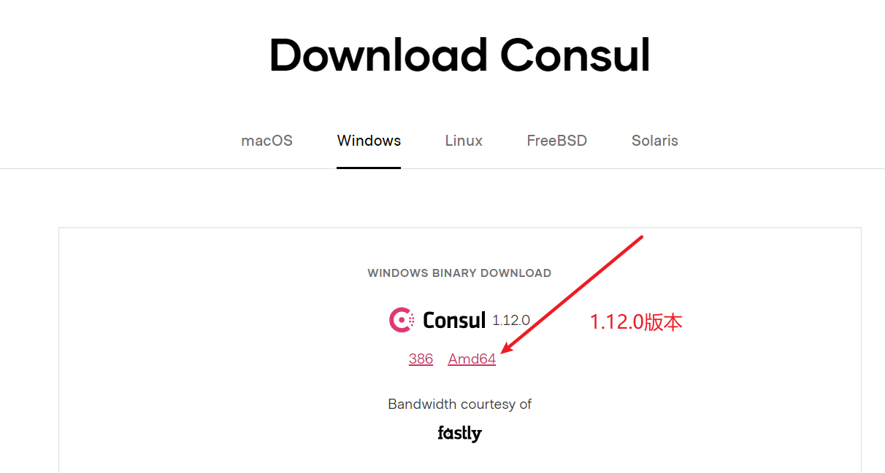
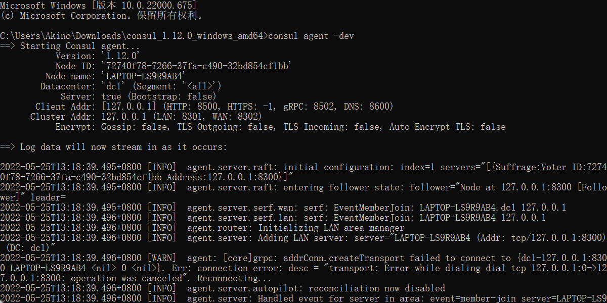

Consul 是一套开源的分布式服务发现和配置管理系统，由 HashiCorp 公司用 `Go` 语言开发

提供了微服务中的服务治理。配置中心，控制总线等功能，这些功能中的每一个都可以根据需要单独使用，也可以在一起使用。

优点：

- 基于 raft 协议，比较简洁

- 支持健康检查，服务发现同时支持 Http 和 DNS 协议支持跨越数据中心的 WAN 集群，提供图形界面跨平台，支持 Linux，Mac，Windows

- KV 存储

- 多数据中心

- 可视化 WEB 界面

# 1. 安装 consul

## 1.1 下载安装包

https://www.consul.io/downloads



## 1.2 cmd运行

```cmd
# 使用开发模式启动
consul agent -dev
```



## 1.3 访问主页

http://localhost:8500


# 2. 创建payment生产者8006模块注册到 Consul

## 2.1 创建项目New Module

单独用于注册到 Consul 中

名字：cloud-providerConsul-payment8006

## 2.2 pom 依赖引入

```xml
<dependencies>
    <!-- 引入自己定义的api通用包，可以使用Payment支付Entity -->
    <dependency>
        <groupId>com.atguigu.springcloud</groupId>
        <artifactId>cloud-api-commons</artifactId>
        <version>${project.version}</version>
    </dependency>
    <!--SpringCloud consul-server -->
    <dependency>
        <groupId>org.springframework.cloud</groupId>
        <artifactId>spring-cloud-starter-consul-discovery</artifactId>
    </dependency>
    <!-- SpringBoot整合Web组件 -->
    <dependency>
        <groupId>org.springframework.boot</groupId>
        <artifactId>spring-boot-starter-web</artifactId>
    </dependency>
    <dependency>
        <groupId>org.springframework.boot</groupId>
        <artifactId>spring-boot-starter-actuator</artifactId>
    </dependency>
    <!--日常通用jar包配置-->
    <dependency>
        <groupId>org.springframework.boot</groupId>
        <artifactId>spring-boot-devtools</artifactId>
        <scope>runtime</scope>
        <optional>true</optional>
    </dependency>
    <dependency>
        <groupId>org.projectlombok</groupId>
        <artifactId>lombok</artifactId>
        <optional>true</optional>
    </dependency>
    <dependency>
        <groupId>org.springframework.boot</groupId>
        <artifactId>spring-boot-starter-test</artifactId>
        <scope>test</scope>
    </dependency>
    <dependency>
        <groupId>cn.hutool</groupId>
        <artifactId>hutool-all</artifactId>
        <version>RELEASE</version>
        <scope>test</scope>
    </dependency>
    <dependency>
        <groupId>cn.hutool</groupId>
        <artifactId>hutool-all</artifactId>
        <version>RELEASE</version>
        <scope>test</scope>
    </dependency>
</dependencies>
```

## 2.3 配置文件application.yml

```yaml
###consul服务端口号
server:
  port: 8006

spring:
  application:
    name: consul-provider-payment
  ####consul注册中心地址
  cloud:
    consul:
      host: localhost
      port: 8500
      discovery:
        #hostname: 127.0.0.1
        service-name: ${spring.application.name}
```

## 2.4 主启动类注册到 Consul中

```java
@SpringBootApplication
@EnableDiscoveryClient
public class PyammentMain8006 {
    public static void main(String[] args) {
        SpringApplication.run(PyammentMain8006.class, args);
    }
}
```

## 2.5 Controller

```java
@RestController
@Slf4j
public class PaymentController {

    @Value("${server.port}")
    private String serverPort;

    @RequestMapping(value = "/payment/consul")
    public String paymentConsul() {
        return "springcloud with consul: "+serverPort+"\t   "+ UUID.randomUUID().toString();
    }
}
```


# 3. 创建order消费者80模块注册到Consul

## 3.1 创建项目New Module

单独用于注册到 Consul 中

名字：cloud-consumerConsul-order80

## 3.2 pom依赖引入

```xml
<dependencies>
    <!--SpringCloud consul-server -->
    <dependency>
        <groupId>org.springframework.cloud</groupId>
        <artifactId>spring-cloud-starter-consul-discovery</artifactId>
    </dependency>
    <!-- SpringBoot整合Web组件 -->
    <dependency>
        <groupId>org.springframework.boot</groupId>
        <artifactId>spring-boot-starter-web</artifactId>
    </dependency>
    <dependency>
        <groupId>org.springframework.boot</groupId>
        <artifactId>spring-boot-starter-actuator</artifactId>
    </dependency>
    <!--日常通用jar包配置-->
    <dependency>
        <groupId>org.springframework.boot</groupId>
        <artifactId>spring-boot-devtools</artifactId>
        <scope>runtime</scope>
        <optional>true</optional>
    </dependency>
    <dependency>
        <groupId>org.projectlombok</groupId>
        <artifactId>lombok</artifactId>
        <optional>true</optional>
    </dependency>
    <dependency>
        <groupId>org.springframework.boot</groupId>
        <artifactId>spring-boot-starter-test</artifactId>
        <scope>test</scope>
    </dependency>
</dependencies>
```

## 3.3 配置文件application.yml

```yaml
###consul服务端口号
server:
  port: 80

spring:
  application:
    name: cloud-consumer-order
  ####consul注册中心地址
  cloud:
    consul:
      host: localhost
      port: 8500
      discovery:
        #hostname: 127.0.0.1
        service-name: ${spring.application.name}
```

## 3.4 主启动类注册到Consul中

```java
@SpringBootApplication
@EnableDiscoveryClient
public class OrderConsulMain80 {
    public static void main(String[] args) {
        SpringApplication.run(OrderConsulMain80.class, args);
    }
}
```

## 3.5 配置Bean（RestTemplate）

配置类注册

```java
@Configuration
public class ApplicationContextConfig {
    @Bean
    @LoadBalanced
    public RestTemplate getRestTemplate() {
        return new RestTemplate();
    }
}
```

## 3.6 Controller

```java
@RestController
@Slf4j
public class OrderConsulController {
    public static final String INVOKE_URL = "http://cloud-provider-payment";

    @Resource
    private RestTemplate restTemplate;

    @GetMapping(value = "/consumer/payment/consul")
    public String paymentInfo() {
        String result = restTemplate.getForObject(INVOKE_URL+"/payment/consul",String.class);
        return result;
    }
}
```

## 3.7 测试

然后启动即可注册到 Consul

访问：localhost/consumer/payment/consul 查看是否服务调用成功