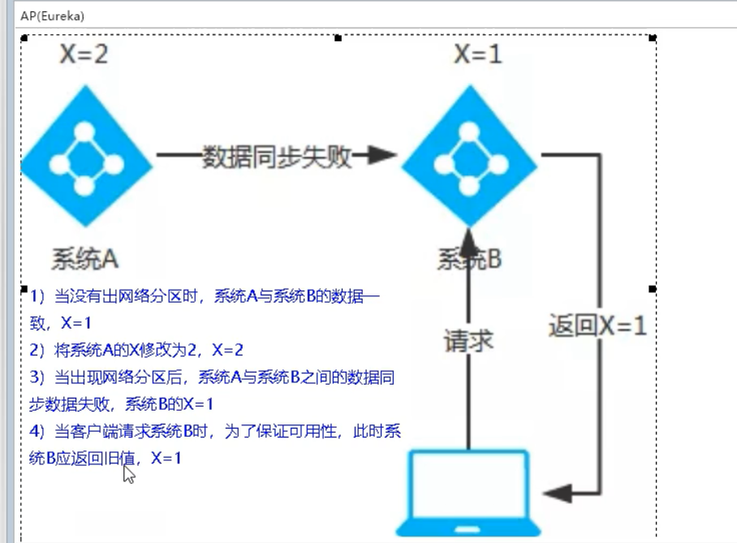

CAP：[一致性](https://baike.baidu.com/item/一致性/9840083)（Consistency）、[可用性](https://baike.baidu.com/item/可用性/109628)（Availability）、[分区容错性](https://baike.baidu.com/item/分区容错性/23734073)（Partition tolerance）。

- zookeeper 当主节点故障时，zk 会在剩余节点重新选择主节点，耗时过长，虽然最终能够恢复，但是选取主节点期间会导致服务不可用，这是不能容忍的。
- eureka 各个节点是平等的，一个节点挂掉，其他节点仍会正常保证服务。

